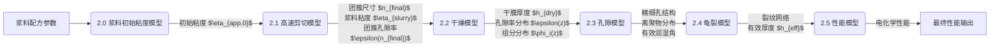

# 串联模型研究：从浆料制备到催化剂层性能的全周期分析

## 1. 引言

本研究旨在通过串联四个核心物理化学模型——剪切模型、干燥模型、皲裂模型和性能模型——来系统性地分析和预测催化剂层从浆料制备到最终电化学性能的全生命周期。当前，催化剂层的微观结构（如厚度、孔隙率、裂纹分布）及其均一性对器件的整体性能（如能量密度、功率密度、循环寿命）起着决定性作用。然而，这些微观结构特性受到复杂的多因素影响，包括原材料的选择、浆料的流变特性、涂布工艺参数、干燥条件以及后续处理等。

**核心研究问题**：
1.  **材料特性的影响**：不同活性物质（如NMC, LFP等）、导电剂、粘结剂的物理化学性质（如粒径分布、表面能、机械性能）如何影响浆料的流变行为、湿膜的干燥动力学、干膜的应力演化及开裂行为，并最终决定催化剂层的有效厚度和微观形貌？
2.  **加工工艺的耦合作用**：涂布过程中的剪切速率、刮刀参数，干燥过程中的温度、湿度、气流速率等工艺参数，如何与材料特性相互作用，共同调控催化剂层的最终结构？
3.  **微观结构与宏观性能的关联**：催化剂层的最终厚度、孔隙率、孔径分布、裂纹网络等微观结构参数，如何定量地影响其电化学性能，如离子/电子传输阻抗、活性面积、倍率性能和循环稳定性？

特别地，我们将重点关注**皲裂模型中对于催化剂层有效厚度的精确计算**。实际生产过程中，即使浆料配方一致，不同批次的原材料或基底表面特性的微小差异，以及加工工艺的波动，都可能导致最终催化剂层在厚度、孔隙率等方面出现显著差别，这直接影响器件的能量密度和功率输出。目前，多数模型未能充分考虑不同材料（如不同类型的活性颗粒、粘结剂）的表面特性（如表面张力、与基底的粘附力）及初始孔隙结构对催化剂层最终有效厚度的定量影响。本研究期望通过整合的模型，更深入地理解这些因素的作用机制。

**四个核心模型概览**：
*   **剪切模型**：模拟浆料在涂布过程中的流变行为，预测初始湿膜的厚度及其均匀性。
*   **干燥模型**：模拟湿膜在干燥过程中的溶剂蒸发、溶质迁移和颗粒堆积，预测干膜的厚度、孔隙结构和组分分布。
*   **皲裂模型**：模拟干膜在残余应力作用下的开裂行为，预测裂纹的形貌特征，并计算考虑裂纹影响后的有效催化剂层厚度。
*   **性能模型**：基于最终的催化剂层微观结构（有效厚度、孔隙率、裂纹等），预测其电化学性能。

通过这四个模型的有机串联，我们期望建立一个从"材料-工艺"到"结构-性能"的综合性预测平台，为催化剂层的设计和优化提供理论指导。

## 2.0 浆料初始粘度模型

### 2.0.1 模型目标

准确预测催化剂浆料在低剪切速率下的初始表观粘度 ($\eta_{app,0}$)。该粘度值将作为后续高速剪切模型、涂布模型等的重要输入参数。理解初始粘度有助于优化浆料配方，确保其具有良好的加工性能和稳定性。

### 2.0.2 关键输入参数

*   **固相参数**:
    *   催化剂颗粒密度 ($\rho_c$)
    *   碳载体颗粒密度 ($\rho_s$)
    *   催化剂固含量 ($w_c$, 重量百分比)
    *   碳载体固含量 ($w_s$, 重量百分比)
    *   初级颗粒平均粒径 ($d_p$)
    *   颗粒堆积因子/最大体积分数 ($\phi_m$)
*   **离聚物参数**:
    *   离聚物密度 ($\rho_i$)
    *   离聚物固含量 ($w_i$, 重量百分比)
    *   离聚物分子量 ($M_w$) (可选，用于更复杂的模型)
*   **溶剂参数**:
    *   溶剂密度 ($\rho_{sol}$)
    *   溶剂粘度 ($\eta_{sol}$)
    *   溶剂介电常数 ($\epsilon_{sol}$) (可选，用于考虑静电相互作用的模型)
*   **其他**:
    *   温度 ($T$)

### 2.0.3 关键输出

*   **浆料初始表观粘度 ($\eta_{app,0}$)**

### 2.0.4 关键理论与公式

催化剂浆料通常是浓缩悬浮液，其粘度行为复杂。根据 Yoshimune & Harada (2019) 的研究，离聚物在浆料中分为吸附在催化剂颗粒（如Pt/C）表面的部分和未吸附而分散在溶剂中的部分（非吸附离聚物）。这两部分对浆料粘度的贡献机制不同。

1.  **基准溶剂粘度**: $\\eta_{sol}$ (纯溶剂，如水/酒精混合物)。

2.  **非吸附离聚物对溶剂粘度的提升**:
    *   非吸附的离聚物溶解在溶剂中，会增加基础溶剂的粘度，形成一个"有效溶剂相"。其贡献可以通过 **Huggins方程** 描述，此时应使用 **非吸附离聚物的浓度 ($C_{non-ads}$)** 或体积分数 ($\\phi_{non-ads}$):
        \\\\[ \\eta_{sp,non-ads}/C_{non-ads} = [\\eta] + k_H [\\eta]^2 C_{non-ads} \\\\]
        其中 $\\eta_{sp,non-ads} = (\\eta_{eff\_sol} - \\eta_{sol})/\\eta_{sol}$ 是由非吸附离聚物引起的增比粘度，$\\eta_{eff\_sol}$ 是有效溶剂相的粘度，$C_{non-ads}$ 是非吸附离聚物的质量浓度，$k_H$ 是Huggins常数。
    *   因此，有效溶剂相的粘度为: $\\eta_{eff\_sol} = \\eta_{sol}(1 + [\\eta]C_{non-ads} + k_H [\\eta]^2 C_{non-ads}^2)$。

3.  **固相颗粒（Pt/C，已吸附离聚物）在有效溶剂相中的贡献**:
    *   吸附了离聚物的催化剂颗粒（或团簇）可以视为分散相，分散在上述由非吸附离聚物形成的有效溶剂相 (粘度为 $\\eta_{eff\_sol}$) 中。
    *   这部分的粘度贡献可以采用浓缩悬浮液模型，如 **Krieger-Dougherty方程**:
        \\\\[ \\eta_{rel,slurry} = \\frac{\\eta_{slurry}}{\\eta_{eff\_sol}} = \\left(1 - \\frac{\\phi_{solid,eff}}{\\phi_m}\\right)^{-[\\eta]_{particle}\\phi_m} \\\\]
        其中，$\\eta_{slurry}$ 是最终浆料的粘度，$\\phi_{solid,eff}$ 是固相颗粒（包括其表面的吸附层）的有效体积分数，$[\\eta]_{particle}$ 是颗粒的特性粘度 (对于球形颗粒通常取2.5)，$\\phi_m$ 是固相颗粒的最大堆积体积分数，取决于颗粒形状、尺寸分布和聚集状态 (通常在0.5-0.7之间)。
    *   或者 **Quemada模型**:
        \\\\[ \\eta_{rel,slurry} = \\left(1 - \\frac{\\phi_{solid,eff}}{\\phi_m}\\right)^{-2} \\\\]

4.  **Yoshimune & Harada (2019) 针对高剪切速率的催化剂墨水粘度模型**:
    该研究提出，在高剪切速率下 (如 1000 s⁻¹)，碳网络结构被破坏，浆料粘度 $\\eta$ 可以表示为溶剂粘度、Pt/C颗粒的贡献以及非吸附离聚物的贡献之和：
    \\\\[ \\eta = \\eta_{sol} + \\Delta\\eta_p + \\Delta\\eta_i \\\\]
    其中：
    *   $\\eta_{sol}$ 是基础溶剂的粘度。
    *   $\\Delta\\eta_p = 2.5 \\eta_{sol} \\phi_{Pt/C}$ 是由Pt/C颗粒引起的粘度增量 (类Einstein贡献)，$\\phi_{Pt/C}$ 是Pt/C颗粒的体积分数。
    *   $\\Delta\\eta_i = \\eta_{sol}([\\eta]C_{non-ads} + k_H[\\eta]^2C_{non-ads}^2)$ 是由非吸附离聚物引起的粘度增量 (Huggins贡献)，$C_{non-ads}$ 是非吸附离聚物的浓度。
    组合后得到:
    \\\\[ \\eta = \\eta_{sol}(1 + 2.5\\phi_{Pt/C} + [\\eta]C_{non-ads} + k_H[\\eta]^2C_{non-ads}^2) \\\\] (式 Y&H)
    这个模型特别适用于高剪切条件，并且强调了区分和量化非吸附离聚物的重要性。

5.  **低剪切速率下的行为与屈服应力**:
    *   在低剪切速率下，颗粒间的相互作用（由吸附离聚物调节）和网络结构的形成可能导致非牛顿行为，如剪切稀化和屈服应力。
    *   **Casson模型 / Herschel-Bulkley模型**: 可用于描述具有屈服应力的浆料。
        *   Herschel-Bulkley: $\\tau = \\tau_0 + K \\dot{\\gamma}^n$
        *   表观粘度: $\\eta_{app} = \\tau/\\dot{\\gamma} = \\tau_0/\\dot{\\gamma} + K \\dot{\\gamma}^{n-1}$
        对于"初始粘度"，通常指低剪切速率下的表观粘度，或通过这些模型外推得到的参数。

### 2.0.5 实现逻辑

1.  **计算各组分体积分数与总离聚物浓度**:
    *   根据输入的各组分质量分数 ($w_c, w_s, w_i$) 和密度 ($\\rho_c, \\rho_s, \\rho_i, \\rho_{sol}$)，计算它们在浆料中的体积分数 ($\\phi_c, \\phi_s, \\phi_{i,total}$) 以及总固相体积分数 ($\\phi_{solid} = \\phi_c + \\phi_s$) 和总离聚物的质量浓度 ($C_{i,total}$)。

2.  **确定非吸附离聚物的体积分数 ($\\phi_{non-ads}$) 或浓度 ($C_{non-ads}$)**:
    *   **关键步骤**: 这是应用Yoshimune & Harada模型的关键。
    *   该值可能需要通过实验方法（如论文中使用的CV-SANS或改进的过滤法）确定。
    *   或者，可以通过吸附模型（如Langmuir吸附等温线）结合颗粒比表面积和总离聚物量来估算吸附量，进而得到非吸附量。例如：
        *   总离聚物量 - 吸附在Pt/C表面的离聚物量 = 非吸附离聚物量。
        *   吸附量可以基于颗粒总表面积和单位面积的最大吸附量（或吸附平衡常数）计算。
    *   如果缺乏直接数据，可能需要将其作为一个可调参数或基于文献数据进行估算。

3.  **计算有效连续相粘度 ($\\eta_{eff\_sol}$)**:
    *   使用Huggins方程（或直接使用式 Y&H 中的 $\\Delta\\eta_i$ 部分），基于 **非吸附离聚物浓度 $C_{non-ads}$** 和纯溶剂粘度 $\\eta_{sol}$，计算有效溶剂相的粘度 $\\eta_{eff\_sol} = \\eta_{sol} + \\Delta\\eta_i$。

4.  **应用浓缩悬浮液模型计算总浆料粘度 (适用于非高剪切情况或作为通用模型思路)**:
    *   将 $\\eta_{eff\_sol}$ 作为基础粘度。
    *   计算固相颗粒（Pt/C，其表面可能已吸附部分离聚物）的有效体积分数 $\\phi_{solid,eff}$。这可能等于 $\\phi_c + \\phi_s$，或者需要考虑吸附层对颗粒有效体积的贡献。
    *   将 $\\phi_{solid,eff}$ 和最大堆积体积分数 $\\phi_m$ 代入Krieger-Dougherty或Quemada等模型，计算浆料的相对粘度或绝对粘度 $\\eta_{slurry}$。
    *   例如，使用Krieger-Dougherty: $\\eta_{slurry} = \\eta_{eff\_sol} \\left(1 - \\frac{\\phi_{solid,eff}}{\\phi_m}\\right)^{-[\\eta]_{particle}\\phi_m}$。

5.  **高剪切粘度计算 (可选，若关注高剪切行为)**:
    *   直接应用 Yoshimune & Harada (2019) 的公式 (式 Y&H):
        $\\eta = \\eta_{sol}(1 + 2.5\\phi_{Pt/C} + [\\eta]C_{non-ads} + k_H[\\eta]^2C_{non-ads}^2)$
        需要参数：$\\eta_{sol}$, $\\phi_{Pt/C}$ (通常等于 $\\phi_c + \\phi_s$), $C_{non-ads}$, 特性粘度 $[\\eta]$ 和 Huggins常数 $k_H$ (可从文献或实验获取)。

6.  **参数校准与选择**:
    *   模型中的参数如 $\\phi_m$, 颗粒的特性粘度 $[\\eta]_{particle}$, 离聚物的Huggins常数 $k_H$ 和特性粘度 $[\\eta]$，以及非吸附离聚物的量，是准确预测的关键。这些参数通常需要通过实验数据校准或引用针对类似体系的文献值。
    *   如果浆料表现出明显的非牛顿行为（如屈服应力），则可能需要选择能描述该行为的模型（如Herschel-Bulkley），并明确初始粘度是指在特定低剪切条件下的表观粘度，或者外推到零剪切的粘度（若存在）。

### 2.0.6 与其他模型的关联

*   **输出**:
    *   `浆料初始粘度 ($\eta_{app,0}$)`: 作为"2.1 高速剪切模型"中计算初始团聚体尺寸和剪切力的重要输入。
    *   `浆料初始粘度 ($\eta_{app,0}$)`: 也可能作为后续"涂布模型"的输入参数，影响湿膜的流平性和厚度均匀性。
*   **依赖**:
    *   该模型不直接依赖于其他前序模型，而是基于浆料的原始配方参数。

## 2. 核心模型详解

### 2.1 高速剪切模型：浆料流变与初始湿膜形成 (基于 `matlab_high_speed_shearing_model_py`)

**目标**：预测浆料在刮刀涂布或狭缝挤出等工艺中的流变行为，特别是浆料内部颗粒团簇尺寸的动态演化，并基于此评估对初始湿膜形成的影响。核心代码为 `matlab_high_speed_shearing_model_py/core_hss_solver.py`。

**核心关注点 (`core_hss_solver.py`)**:
该 Python 脚本的核心是通过求解一个常微分方程 (ODE) 来模拟在特定剪切和超声条件下，浆料中初级颗粒团簇的平均尺寸（以团簇内初级粒子数 $n$ 表示）随时间的变化。这个团簇尺寸直接影响浆料的宏观流变特性和最终涂层的微观结构。

**关键输入参数 (来自 `run_high_speed_shearing_model_from_document` 函数及其调用的内部函数)**：
*   **初始条件**:
    *   `n_initial`: 初始平均团簇尺寸 (初级粒子数/团簇)。
    *   `t_span_hss`: 模拟的时间区间 `(t_start, t_end)` (单位：秒)。
    *   `t_eval_hss`: 需要输出结果的特定时间点数组。
*   **材料/浆料基本性质**:
    *   `d_primary_particle_m`: 初级活性物质颗粒的平均直径 (m)。
    *   `phi_solid_fraction`: 浆料的固相体积分数 (无量纲)。
    *   `rho_solvent_kg_m3`: 溶剂密度 (kg/m³)。
    *   `eta_solvent_Pa_s`: 溶剂粘度 (Pa·s)。
    *   `temperature_K`: 体系温度 (K)。
*   **工艺参数**:
    *   `shear_rate_1_s`: 剪切速率 (1/s)。
    *   `ultrasound_power_W_m3`: 单位体积超声功率 (W/m³)。
*   **团簇动力学模型参数**:
    *   `F0_bond_energy_J` (或 `F0_hasegawa_J_mol`, `F0_constant_J_per_bond`): 颗粒间单键结合能。代码支持Hasegawa模型 (键能随团簇尺寸变化) 或恒定键能。
        *   Hasegawa模型: $F_0(n) = F_{0,ref} \cdot n^{e_f}$ (其中 $e_f$ 为指数)。
    *   `alpha_Brownian_coag_eff`, `alpha_ionomer_coag_eff`, `alpha_shear_coag_eff`: 分别对应布朗运动、离聚物桥接、剪切诱导的凝聚效率系数 (无量纲)。
    *   `C_shear_breakup_coeff_empirical`, `C_ultrasound_breakup_coeff_empirical`: 分别对应剪切破碎和超声破碎的经验效率/校正系数 (无量纲)。
    *   `phi_percolation_threshold_HAS`: 团簇孔隙率模型中的逾渗阈值 (Hasegawa模型参数)。
    *   `A_porosity_coeff`, `B_porosity_coeff`: 用于计算团簇孔隙率 $\epsilon(n) = 1 - (\text{A_porosity_coeff} \cdot n^{\text{B_porosity_coeff}})$ 的经验系数。
    *   `EILERS_max_packing_fraction_phi_p`: Eilers模型中颗粒的最大堆积体积分数。
    *   `N_b_exponent_in_Rb_shear_breakup`, `N_b_coeff_in_Rb_shear_breakup`: 用于计算剪切破碎时需断裂的键数 $N_b = \text{coeff} \cdot n^{\text{exponent}}$ 的参数。
    *   `ultrasound_zeta_Nb_factor_for_ultrasonic_breakup`: 超声破碎中键数 $N_b$ 的调整因子 $\zeta$。
*   **文档/场景标识**:
    *   `document_name_hss`, `scenario_name_hss`: 用于结果保存和区分。

**关键输出参数 (来自 `run_high_speed_shearing_model_from_document` 函数)**：
*   `sol_hss.t`: 求解得到的时间点数组。
*   `sol_hss.y[0]`: 在上述时间点对应的平均团簇尺寸 $n(t)$ 数组。
*   保存的CSV文件 (`{document_name_hss}_{scenario_name_hss}_HSS_results.csv`): 包含时间、团簇尺寸、浆料粘度、团簇孔隙率等。
*   (可选) 绘图输出。

**核心理论与公式 (ODE系统 `cluster_evolution_ode_hss`)**:
模型的核心是以下微分方程，描述了平均团簇尺寸 $n$ 随时间 $t$ 的变化率：
\\[ \frac{dn}{dt} = R_{coag,Brown} + R_{coag,Ionomer} + R_{coag,Shear} - R_{break,Shear} - R_{break,Ultrasound} \\]
各项的具体形式在代码中实现如下：

1.  **布朗凝聚速率 ($R_{coag,Brown}$)**:
    \\[ R_{coag,Brown} = \alpha_{Brownian\_coag\_eff} \cdot \frac{4 k_B T N_p}{3 \eta_{solvent}} \\]
    其中 $N_p = \phi_{solid\_fraction} / (\frac{\pi}{6} d_{primary\_particle}^3)$ 是单位体积内的初级粒子数。

2.  **离聚物桥接凝聚速率 ($R_{coag,Ionomer}$)**:
    形式上与布朗凝聚类似，使用不同的效率系数 $\alpha_{ionomer\_coag\_eff}$。
    \\[ R_{coag,Ionomer} = \alpha_{ionomer\_coag\_eff} \cdot \frac{4 k_B T N_p}{3 \eta_{solvent}} \\]
    (注：代码中将两者合并为 $R_{coag,Brown+Ionomer} = (\alpha_{Brownian\_coag\_eff} + \alpha_{ionomer\_coag\_eff}) \cdot \frac{4 k_B T N_p}{3 \eta_{solvent}}$ )

3.  **剪切凝聚速率 ($R_{coag,Shear}$)**:
    \\[ R_{coag,Shear} = \alpha_{shear\_coag\_eff} \cdot \frac{4 \phi_{solid\_fraction} n \dot{\gamma}}{\pi} \\]

4.  **剪切破碎速率 ($R_{break,Shear}$)**:
    \\[ R_{break,Shear} = C_{shear\_breakup\_coeff\_empirical} \cdot \frac{\phi_{solid\_fraction} n^2 d_{primary\_particle}^3 \eta_{slurry} \dot{\gamma}^2}{F_0(n) N_b(n) (1-\epsilon(n))} \\]
    其中：
    *   $\eta_{slurry}$: **浆料粘度**，动态计算。代码中使用了Eilers模型：
        \\[ \eta_{slurry} = \eta_{solvent} \left(1 + \frac{1.25 \phi_{eff}}{1 - \phi_{eff} / \phi_{p,max,Eilers}}\right)^2 \\]
        其中有效体积分数 $\phi_{eff} = \phi_{solid\_fraction} / (1-\epsilon(n))$。
    *   $F_0(n)$: **单键结合能**，可以是Hasegawa模型 ($F_0(n) = F_{0,ref} \cdot n^{e_f}$) 或常数。
    *   $N_b(n)$: **剪切破碎时需断裂的键数**，模型为 $N_b(n) = N_{b\_coeff} \cdot n^{N_{b\_exponent}}$。
    *   $\epsilon(n)$: **团簇孔隙率**，模型为 $\epsilon(n) = 1 - (A_{porosity\_coeff} \cdot n^{B_{porosity\_coeff}})$ (当 $A \cdot n^B < 1$) 或使用Hasegawa孔隙率模型: $\epsilon(n) = 1 - \phi_s / ( (1-\phi_s) \cdot \frac{(n-1)\phi_{perc}}{1-(n-1)\phi_{perc}} + \phi_s)$，这取决于 `use_hasegawa_porosity_model` 标志。

5.  **超声破碎速率 ($R_{break,Ultrasound}$)**:
    \\[ R_{break,Ultrasound} = C_{ultrasound\_breakup\_coeff\_empirical} \cdot \frac{P_{ultrasound}}{F_0(n) N_{b,ultra}(n)} \cdot \frac{\pi d_{primary\_particle}^3 (1-\epsilon(n)) n(n-1)}{6} \\]
    其中：
    *   $P_{ultrasound}$ 是单位体积超声功率。
    *   $N_{b,ultra}(n)$: **超声破碎时需断裂的键数**，基于剪切破碎的 $N_b(n)$ 乘以一个调整因子 $\zeta_{ultra}$。

**实现逻辑 (`core_hss_solver.py`)**:
1.  **参数解析与初始化**: `run_high_speed_shearing_model_from_document` 函数首先从输入字典中提取所有必要的参数。
2.  **定义ODE系统**: `cluster_evolution_ode_hss` 函数定义了上述 $dn/dt$ 的完整表达式，其中包含了对 $\eta_{slurry}(n)$, $\epsilon(n)$, $F_0(n)$, $N_b(n)$ 等随当前团簇尺寸 $n$ 动态变化的量的计算。
3.  **ODE求解**: 使用 `scipy.integrate.solve_ivp` 求解该ODE系统，方法通常为 'RK45' 或 'BDF'，带有事件监测（例如，监测$n$是否达到某个阈值，尽管当前代码中未显式定义此类事件用于终止）。
4.  **结果后处理与保存**: 求解完成后，提取时间序列和对应的团簇尺寸 $n(t)$。计算其他相关物理量（如浆料粘度、孔隙率）并保存到CSV文件。
5.  **绘图 (可选)**: 可调用绘图函数可视化 $n(t)$ 和 $\eta_{slurry}(t)$ 等。

**与传统流变模型的区别与联系**:
*   传统的流变模型（如幂律、Herschel-Bulkley）直接描述宏观的应力-应变率关系，通常不显式考虑微观团簇结构。
*   此处的团簇演化模型从微观机制出发，通过模拟团簇尺寸的变化，间接影响通过Eilers模型等计算得到的宏观浆料粘度 $\eta_{slurry}$。
*   两者可以结合：团簇模型预测的稳态团簇尺寸（或特定剪切历史后的团簇尺寸）可以用来参数化宏观流变模型中的某些参数，或者宏观流变测量数据可以用来校准团簇模型中的经验系数。

**初始湿膜厚度的估算**:
该 `core_hss_solver.py` 脚本本身不直接计算湿膜厚度。湿膜厚度 ($h_{wet}$) 的确定通常依赖于涂布工艺（如刮刀间隙、涂布速度）和浆料在涂布区间的实际流变行为（由 $\eta_{slurry}$ 表征）。
传统的估算公式如 $h_{wet} \approx C \cdot H_{gap}$ (其中 $C \approx 0.5$) 仍然是一个初步近似。更精确的计算需要将此模型预测的 $\eta_{slurry}(\dot{\gamma}, n)$（其中 $n$ 可能也受 $\dot{\gamma}$ 影响达到一个动态平衡）输入到流体动力学模拟 (CFD) 中，求解特定涂布几何下的Navier-Stokes方程。

**与后续模型的关联**:
*   该模型预测的最终（或某个特征时刻）的平均团簇尺寸 $n_{final}$ 和相应的团簇孔隙率 $\epsilon(n_{final})$ 是后续**干燥模型**和**孔隙模型**的重要输入。它们共同决定了湿膜干燥前的初始孔隙结构、颗粒堆积状态，并影响干燥过程中的溶剂蒸发和颗粒迁移行为。
*   预测的浆料粘度 $\eta_{slurry}$ 可用于评估涂布过程的稳定性，并间接影响初始湿膜的均匀性，这也是干燥模型的输入。

### 2.2 干燥模型：溶剂蒸发、颗粒迁移与固化成膜 (基于 `matlab_drying_model_phi10_py`)

此模型旨在模拟湿膜在干燥过程中，两种固体颗粒（`phi1`, `phi2`）在一维厚度方向（归一化坐标 `xi`，从0到1）和归一化时间（`t` 或 `tau`）的体积分数演化。它重点关注由于溶剂蒸发导致的颗粒迁移、颗粒间的相互作用（通过沉积系数 `K` 和压缩系数 `Z` 体现）、以及它们最终在干膜中的分布和可能出现的分层现象。该模型的Python实现位于 `matlab_drying_model_phi10_py/core_solver.py`，其核心PDE（偏微分方程）公式严格遵循一个名为 `phi_10.py` 的参考脚本。

#### 2.2.1 模型目标与核心功能
*   **预测组分分布**：模拟并预测两种固体颗粒（`phi1`, `phi2`）在干燥过程中沿涂层厚度方向的体积分数分布随时间的演变。
*   **量化组分分层**：计算最终干膜中各组分的具体分布，并特别量化某一特定组分（例如 `phi2`）在涂层顶部区域相对于其初始平均浓度的富集程度。
*   **参数影响分析**：评估不同的物理化学参数（如有效Peclet数、初始浓度分布、干燥温度、蒸发速率因子）对颗粒迁移行为和最终干膜微观结构的影响。
*   **确定干燥终点**：通过监测任一位置的颗粒体积分数之和是否达到预设的最大堆积密度 (`PHI_MAX_PACKING`) 来确定干燥过程的终止。

#### 2.2.2 关键输入参数
主要输入参数由核心函数 `solve_pde_phi10_based` 接收：
*   **初始条件**:
    *   `phi1_0_array`: 固体颗粒组分1初始的体积分数沿厚度方向的分布数组 (长度为 `N_points`)。
    *   `phi2_0_array`: 固体颗粒组分2初始的体积分数沿厚度方向的分布数组 (长度为 `N_points`)。
*   **流体与传质参数**:
    *   `Pe1_nominal`: 组分1的名义Peclet数，表征对流与扩散的相对强度。
    *   `Pe2_nominal`: 组分2的名义Peclet数。
*   **工艺与环境参数**:
    *   `actual_drying_temp_K`: 实际的干燥温度 (单位：开尔文)，默认为 `DEFAULT_NOMINAL_TEMP_K` (298.15 K)。
    *   `nominal_ref_temp_K`: 定义名义Peclet数时所用的参考温度 (单位：开尔文)，默认为 `DEFAULT_NOMINAL_TEMP_K` (298.15 K)。
    *   `E_evaporation_rate_factor`: 蒸发速率调整因子，用于修正名义Peclet数以得到有效Peclet数，默认为1.0。
*   **数值模拟参数**:
    *   `N_points`: 空间离散点数 (即沿厚度方向的网格点数)，默认为10。
    *   `tau_min`, `tau_max`: 归一化时间的求解起止点，默认为0.17和0.99。
    *   `t_eval_points` (可选): 一个包含特定时间点的数组，求解器将在这些时间点输出结果。若未提供，则使用 `num_tau_points`。
    *   `num_tau_points` (可选): 如果 `t_eval_points` 未提供，则在 `tau_min` 和 `tau_max` 之间生成此数量的等距时间点用于输出。
*   **物理限制**:
    *   `PHI_MAX_PACKING`: 颗粒能达到的最大总堆积体积分数，在代码中硬编码为 0.64。
*   **其他参数**:
    *   `E_parameter`: 一个透传给求解器内部结构的参数，其具体物理意义在 `core_solver.py` 中未明确定义，但在 `phi_10.py` 原始脚本中可能与蒸发或对流有关。此参数会被原样返回。

#### 2.2.3 关键输出参数
`solve_pde_phi10_based` 函数返回一个包含以下主要信息的元组：
*   `sol_t`: 求解器输出结果的各个时间点数组。
*   `phi1_solutions`: 在上述时间点，组分1的体积分数沿厚度方向的分布 (二维数组，行为空间点，列为时间点)。结果经过 `np.maximum(0, ...)` 处理，确保为非负。
*   `phi2_solutions`: 组分2的体积分数沿厚度方向的分布 (类似 `phi1_solutions`)。
*   `phi_void_solutions`: 孔隙 (或溶剂) 的体积分数分布，计算为 `1 - (phi1_solutions + phi2_solutions)`，并同样确保为非负。
*   `xi_grid`: 归一化的空间网格点数组 (从0到1，长度为 `N_points`)。
*   `stratification_phi2_percent`: 量化组分2 (`phi2`) 在最终干膜顶部10%区域相对于其初始平均浓度的富集百分比。正值表示富集，负值表示贫化。
*   `Pe1_eff`, `Pe2_eff`: 模型在计算中实际使用的、经过温度和蒸发速率调整后的有效Peclet数。
*   `message`: 来自 `scipy.integrate.solve_ivp` 求解器的状态消息。
*   `status`: 来自 `scipy.integrate.solve_ivp` 求解器的终止状态码 (例如，0表示成功完成，1表示达到终止事件)。
*   `E_param_out`: 输入的 `E_parameter` 被原样返回。

#### 2.2.4 关键理论与公式
模型的核心是 `pde_system_phi10_formulation` 函数中定义的偏微分方程组，该函数在空间上离散化，然后作为常微分方程组 (ODEs) 由 `solve_ivp` 求解。

*   **PDE 系统**: 描述两种固体颗粒体积分数 `phi1(xi, t)` 和 `phi2(xi, t)` 随归一化时间和归一化空间位置变化率 `dphi_i/dt` 的复杂对流-扩散型方程。其一般形式为：
    \\[ \\frac{d\\phi_i}{dt} = \\text{DiffusionTerm}_i - \\text{ConvectionTerm}_i \\quad (i=1,2) \\]
    其中：
    *   **DiffusionTerm**:  $\\frac{1}{Pe_{i,eff} (1-t)^2} \\frac{\\partial}{\\partial\\xi} (\\text{term1}_i \\cdot \\text{term2}_i)$
        *   `term1_i` 和 `term2_i` 是包含 `phi1`, `phi2`, 它们各自的空间梯度 (`dphi1_dxi`, `dphi2_dxi`)，梯度比值，以及动态计算的沉积系数 `K_original(phi1, phi2)` 和压缩系数 `Z_original(phi1, phi2)` 的高度非线性项。这些项的具体代数形式非常复杂，严格遵循 `phi_10.py` 中的原始定义，旨在描述颗粒间的复杂相互作用和迁移驱动力。
        *   空间梯度使用 `np.gradient(phi, xi, edge_order=2)` 计算。
    *   **ConvectionTerm**:  $\\frac{\\xi}{1-t} \\frac{\\partial\\phi_i}{\\partial\\xi}$
        这个对流项与位置 `xi` 和时间因子 `1/(1-t)` 相关，暗示了溶剂蒸发引起的向表面的对流效应。

*   **沉积系数 `K_original(phi1, phi2)`**: 该系数基于当前 `phi1` 和 `phi2` 在整个空间域的平均值动态计算，影响颗粒的沉积行为或迁移阻力。
    \\[ K = (1 - \\text{mean}(\\phi_1) - \\text{mean}(\\phi_2))^{6.55} \\]
    当 $1 - \\text{mean}(\\phi_1) - \\text{mean}(\\phi_2) \\le 10^{-9}$ (即平均总固含量接近1) 时，K取一个极小的正值，以避免计算错误。

*   **压缩系数 `Z_original(phi1, phi2)`**: 该系数基于当前平均总固体体积分数与最大堆积密度之差动态计算，影响颗粒堆积的紧密程度或在高浓度时的迁移阻力。
    \\[ Z = \\frac{\\text{PHI_MAX_PACKING}}{\\text{PHI_MAX_PACKING} - (\\text{mean}(\\phi_1) + \\text{mean}(\\phi_2))} \\]
    当分母（最大堆积密度与平均总固含量之差） $\\le 10^{-9}$ 时，Z取一个极大的正值。

*   **有效Peclet数 `Pe_eff`**: 根据名义Peclet数、实际干燥温度、参考温度和蒸发速率因子进行调整，以反映实际工艺条件：
    \\[ Pe_{i,eff} = Pe_{i,nominal} \\cdot E_{evaporation\_rate\_factor} \\cdot \\frac{T_{nominal\_ref\_K}}{T_{actual\_drying\_K}} \\]
    这种调整允许模型考虑温度对扩散系数的依赖性（通常温度越高扩散越快，Pe数越小）以及蒸发速率对对流强度的直接影响。

*   **边界条件**: 在 `xi=0` (基底处，即 `dphi1_dt[0]` 和 `dphi2_dt[0]`) 设为无通量，即 `dphi_i/dt = 0`。在 `xi=1` (表面处) 的边界条件在 `phi_10.py` 的PDE推导中没有显式强制为零通量，但代码中并未对表面点施加特殊处理，其行为由PDE本身的离散化和梯度计算决定。

*   **终止条件 (`event_reached_phi_max_original`)**: 当 `np.max(phi1) + np.max(phi2) >= PHI_MAX_PACKING` 时，求解终止。这意味着在涂层中的任何一个点，两种固体颗粒的体积分数之和（代表总固体体积分数）达到了预设的最大物理堆积极限。事件方向设置为从正到负触发（即当差值 `value - PHI_MAX_PACKING` 从正变负时）。

#### 2.2.5 实现逻辑
`solve_pde_phi10_based` 函数的执行流程如下：
1.  **参数校验与初始化**:
    *   检查输入数组 `phi1_0_array` 和 `phi2_0_array` 的长度是否与 `N_points` 一致。
    *   计算有效Peclet数 (`Pe1_eff`, `Pe2_eff`)。
    *   生成归一化的空间网格 `xi_grid = np.linspace(0, 1, N_points)`。
    *   合并初始浓度分布 `phi1_0_array` 和 `phi2_0_array` 为一维数组 `y0`，作为 `solve_ivp` 的初始条件。
2.  **时间点设置**:
    *   根据用户是否提供了 `t_eval_points` (优先) 或 `num_tau_points` 来确定求解器需要输出结果的时间点数组 `t_eval`。
    *   确定求解的起止时间 `solve_span = (tau_min, tau_max)`。
3.  **PDE求解**: 调用 `scipy.integrate.solve_ivp` 对 `pde_system_phi10_formulation` 定义的（空间离散后的）ODE系统进行时间积分。
    *   积分方法：'RK45' (一种自适应步长的Runge-Kutta方法)。
    *   事件监测：使用 `event_reached_phi_max_original` 函数监测颗粒是否达到最大堆积密度，若达到则终止求解。
    *   `dense_output=True` 用于允许在 `t_eval` 指定的任意时间点获取解。
    *   PDE系统函数 (`pde_system_phi10_formulation`) 和事件函数 (`event_reached_phi_max_original`) 都通过 `args` 参数接收额外的参数如 `Pe1_eff, Pe2_eff, xi, N_points`。
4.  **结果提取与修正**:
    *   从求解器返回的 `sol` 对象中提取时间点 `sol.t` 和对应的解 `sol.y`。
    *   将 `sol.y` 分割成 `phi1_solutions` 和 `phi2_solutions`。
    *   对 `phi1_solutions` 和 `phi2_solutions` 应用 `np.maximum(0, ...)`，确保所有体积分数值在物理上非负。
5.  **后处理计算**:
    *   计算孔隙体积分数 `phi_void_solutions = 1.0 - (phi1_solutions + phi2_solutions)`，并同样确保其非负。
    *   调用 `calculate_stratification` 函数，基于最终的 `phi2_solutions[:, -1]` (最后一个时间点的phi2分布) 和初始的 `phi2_0_array` 计算组分2在干膜顶部10%区域的富集百分比 `stratification_phi2_percent`。
6.  **返回结果**: 将所有计算和提取的结果打包成一个元组返回，包括求解时间、各组分和孔隙的体积分数分布、空间网格、分层指标、有效Peclet数、求解器状态信息和输入的 `E_parameter`。

#### 2.2.6 绘图逻辑 (参考 `test_drying_model_phi10_replicated.py`)
虽然核心求解器不直接绘图，但其输出可用于生成多种可视化：
*   **浓度分布图**: 在特定时间点（如初始、中间、最终）绘制 `phi1`, `phi2`, `phi_total` (即 `phi1+phi2`) 和 `phi_void` 沿归一化厚度 `xi` 的分布曲线。
*   **时间演化图**: 绘制某一特定位置 (`xi`) 或平均值的 `phi1`, `phi2` 体积分数随时间 `t` 的变化。
*   **二维颜色图 (热图)**: 以时间 `t` 为一轴，空间 `xi` 为另一轴，用颜色深浅表示 `phi1` 或 `phi2` 的体积分数，直观展示组分迁移和分层过程。
*   在绘图中，可能会应用文献中提到的 `y_plot = phi / (1 - E * tau)` 变换来比较不同条件下的结果，其中 `E` 可能是蒸发相关的参数，`tau` 是时间。

#### 2.2.7 与后续模型的关联
*   **对孔隙模型 (2.3 孔隙模型)**:
    *   输出的最终干膜中各固体组分 (`phi1_solutions[:, -1]`, `phi2_solutions[:, -1]`) 沿厚度方向的分布，是后续"孔隙模型"细化孔径分布、计算离聚物（如果 `phi1` 或 `phi2` 代表离聚物颗粒）实际分布和评估润湿性的关键输入。
    *   计算得到的最终孔隙率分布 (`phi_void_solutions[:, -1]`) 直接影响材料的局部力学性能（需要结合固体组分的力学参数）和后续孔隙模型中对孔径、连通性等特征的分析。
    *   组分分层情况 (`stratification_phi2_percent`)，例如粘结剂或导电剂的富集或贫化，会显著影响催化剂层的局部性质（如孔壁化学性质、电导率、催化活性、润湿性），这些信息对孔隙模型的参数化（如CAD计算时的表面材料比例）至关重要。
*   **对龟裂模型 (2.4 龟裂模型)**:
    *   干膜中固体组分和孔隙的最终分布，决定了材料局部的力学性能（如杨氏模量、强度——虽然本模型不直接计算，但组分分布是其基础）。不均匀的组分分布可能导致不均匀的应力积累和释放。
    *   孔隙率分布会影响干燥过程中产生的毛细管力以及材料的断裂韧性，这些是龟裂模型分析应力演化和裂纹扩展的重要输入。
    *   如果一种组分（如粘结剂）在表面富集，可能会形成一层"皮肤"，影响整体的收缩行为和开裂模式。
*   **对性能模型 (2.5 性能模型)**:
    *   干膜中固体组分（活性物质、导电剂、离聚物）和孔隙的最终精细分布，是性能模型建立准确几何基础和计算有效传输参数（如有效电导率、有效扩散系数、曲折度）的依据。
    *   组分分层会直接影响局部电化学反应速率（如活性物质的 доступность）和各种过电位（如欧姆过电位、传质过电位），必须在性能模型中予以考虑以获得准确的性能预测。
*   **干膜厚度的确定**: 此模型本身在归一化厚度 `xi` 上操作。要获得实际的干膜厚度，需要结合初始湿膜厚度 $h_{wet}$ (来自高速剪切模型或涂布工艺)、浆料的初始总固相体积分数 $\\phi_{solid, initial}$ 以及模型预测的最终平均固相体积分数 $\\phi_{solid, final} = \\text{mean}(\\text{phi1_solutions[:,-1]} + \\text{phi2_solutions[:,-1]})$ 来计算。一个简化的估算可以是：
    \\[ h_{dry} = h_{wet} \\cdot \\frac{\\phi_{solid, initial}}{1 - \\text{mean}(\\text{phi_void_solutions[:,-1]})} = h_{wet} \\cdot \\frac{\\phi_{solid, initial}}{\\phi_{solid, final}} \\]
    这个 $h_{dry}$ 是后续所有模型（孔隙、龟裂、性能）的重要几何参数。

### 2.3 孔隙模型 (基于 `matlab_pore_model_py`)

此模型旨在详细表征催化剂层在微观尺度下的孔隙结构特征，包括孔径分布、孔隙连通性、以及孔壁的润湿特性（接触角）。这些特性直接影响催化剂层内的物质传输（气体、液体、离子）和电化学反应的有效面积。此部分内容根据 `matlab_pore_model_py` 文件夹中的 Python 代码进行深化，整合了孔径与接触角分布、离聚物分布与膜厚度、以及离聚物排列对接触角的影响。

*   **核心目标**：
    *   预测催化剂层的孔径分布 (Pore Size Distribution, PSD)，区分并量化一次孔（通常较小，源于初级颗粒间堆积）和二次孔（通常较大，源于团簇间或较大缺陷）。
    *   表征孔壁的润湿性，即有效接触角及其分布 (Contact Angle Distribution, CAD)，这受表面材料（Pt/C, 离聚物）及其覆盖率影响。
    *   模拟离聚物在催化剂层内的分布（例如通过ODE描述其覆盖率和对自由孔隙体积的影响）。
    *   基于离聚物的分布和孔隙特性，计算离聚物膜的有效厚度。
    *   评估离聚物分子在界面处的排列情况及其对局部接触角和膜厚度梯度的影响。

*   **关键输入参数 (整合自 `pore_distribution_module.py`, `catalyst_composition_module.py`, `alignment_module.py`)**：
    *   **孔径分布相关 (`pore_distribution_module.py`)**:
        *   一次孔几何平均孔径 (`r_mu1`) 和对数标准差 (`sigma_r1`)。
        *   二次孔几何平均孔径 (`r_mu2`) 和对数标准差 (`sigma_r2`)。
        *   一次孔隙和二次孔隙的体积分数 (`phi1`, `phi2`)。
        *   用于绘图的孔径范围 (`r_plot_min`, `r_plot_max`) 和点数 (`n_points_plot_psd`)。
    *   **接触角及表面覆盖相关 (`pore_distribution_module.py`, `catalyst_composition_module.py`)**:
        *   Pt/C 和离聚物的初始表面覆盖率 (`a_Pt_initial`, `a_ion_initial`)。
        *   Pt/C 和离聚物的本征接触角 (`theta_Pt_deg`, `theta_ion_deg`)。
        *   用于计算有效接触角的"当前孔径" (`current_r_for_cad`)。
        *   假定的接触角分布标准差 (`cad_sigma_assumed_deg`)。
        *   离聚物在Pt/C表面的吸附平衡常数 (`K_ads`) 和最大覆盖度 (`alpha_max`) (来自 `catalyst_composition_module.py` 中 `calculate_ionomer_film_thickness` 的内部逻辑)。
        *   离聚物分子尺寸 (`d_ionomer_molecule_nm`)。
    *   **离聚物分布ODE模型相关 (`catalyst_composition_module.py`)**:
        *   总模拟时间 (`t_total`) 和时间步长 (`dt`)。
        *   总孔隙体积 (`V_pore_total`)，初始自由孔隙体积 (`V_pore_free_initial`)。
        *   总离聚物质量 (`m_ion_total`) 和密度 (`rho_ion`)。
        *   离聚物迁移速率常数 (`k_mig`)、溶解速率常数 (`k_diss`)、沉积速率常数 (`k_dep`)。
        *   与离聚物相关的表面积 (`S_ion_related`)。
    *   **离聚物排列模型相关 (`alignment_module.py`)**:
        *   空间变量 `x` 的范围和离散点数 (或等效的厚度/时间变量)。
        *   作用能参数 (`epsilon_interaction`)。
        *   离聚物链段长度/特征尺寸 (`l_segment`)。
        *   玻尔兹曼常数 ($k_B$) 和温度 ($T$) (隐式在能量项 $epsilon_interaction / (k_B T)$ 中)。
        *   基底或界面特性影响参数 (`theta_surface_base`, `surface_interaction_strength`)。

*   **关键输出参数**:
    *   **`pore_distribution_module.py`**:
        *   孔径 `r` 数组 (`r_array_psd`)。
        *   一次孔和二次孔的概率密度函数 (`psd1`, `psd2`) 及总PSD (`psd_total`)。
        *   接触角 `theta` 数组 (`theta_array_cad`)。
        *   Pt/C 和离聚物覆盖区域的接触角概率密度函数 (`cad_Pt`, `cad_ion`) 及总CAD (`cad_total`)。
        *   联合孔径-接触角分布矩阵 (`joint_psd_cad`)。
    *   **`catalyst_composition_module.py` (`solve_catalyst_composition`)**:
        *   时间数组 (`t_out`)。
        *   离聚物在孔隙表面的覆盖率 (`alpha_ion_t`)。
        *   自由孔隙体积 (`V_pore_free_t`)。
        *   溶解的离聚物质量 (`m_ion_dissolved_t`)。
        *   计算得到的离聚物膜平均厚度 (`h_film_ionomer_nm`)。
    *   **`alignment_module.py` (`calculate_alignment_and_contact_angle`)**:
        *   空间变量数组 (`x_values`)。
        *   离聚物排列参数 (`delta_DA_values`)。
        *   有效接触角 (`theta_eff_values`)。

#### 2.3.4 关键理论与公式
*   **孔径分布 (PSD) (`pore_distribution_module.py`)**:
    *   假设一次孔和二次孔均服从对数正态分布：
        \\[ P(r; r_{\mu}, \\sigma_r) = \\frac{1}{r \\sigma_r \\sqrt{2\\pi}} \\exp\\left(-\\frac{(\\ln r - \\ln r_{\mu})^2}{2\\sigma_r^2}\\right) \\]
        其中 $r$ 是孔径，$r_{\mu}$ 是几何平均孔径，$\\sigma_r$ 是对数标准差。
    *   总PSD是两种孔隙类型PSD的加权和： $PSD_{total} = w_1 \\cdot PSD_1 + w_2 \\cdot PSD_2$，其中权重 $w_1, w_2$ 由输入的体积分数占比 `phi_vol_fraction_pore_type1` 和 `phi_vol_fraction_pore_type2` 决定。

*   **接触角分布 (CAD) (`pore_distribution_module.py`)**:
    *   假设孔壁由两种材料组成，每种材料的接触角服从正态分布：
        \\[ P(\\theta; \\theta_{\mu}, \\sigma_{\\theta}) = \\frac{1}{\\sigma_{\\theta} \\sqrt{2\\pi}} \\exp\\left(-\\frac{(\\theta - \\theta_{\mu})^2}{2\\sigma_{\\theta}^2}\\right) \\]
        其中 $\\theta_{\mu}$ 是该材料的本征接触角 (`theta_intrinsic_deg_material1/2`)，$\\sigma_{\\theta}$ 是接触角的标准差 (`sigma_contact_angle_deg_material1/2`)。
    *   总CAD是两种材料CAD的加权和，权重为各自的表面积占比 (`surface_fraction_material1`, `surface_fraction_material2`)。
    *   **有效接触角**: 可能基于Cassie-Baxter理论或类似混合规则，结合 `current_r_for_cad_nm` 来考虑孔隙几何对宏观接触角的影响，尤其是在部分润湿或复合表面情况下。

*   **离聚物分布与膜厚度 (`catalyst_composition_module.py`)**:
    *   **ODE系统**: 求解描述离聚物在孔隙表面的动态覆盖度 (`alpha_ion`) 和孔隙中自由体积分数 (`alpha_free` 或等效的 `phi_free_pore_volume_fraction`) 的常微分方程组。核心方程可能基于质量守恒和吸附/脱附动力学，例如：
        \\[ \\frac{d(\\text{alpha_ion})}{dt} = k_{ads} \\cdot C_{ion,pore} \\cdot (1 - \\text{alpha_ion}) - k_{des} \\cdot \\text{alpha_ion} \\]
        \\[ \\frac{d(\\text{alpha_free})}{dt} = - \\text{Factor} \\cdot \\frac{d(\\text{alpha_ion})}{dt} \\]
        其中 $C_{ion,pore}$ 是孔隙中离聚物的有效浓度（可能受扩散 `D_eff_ionomer_in_pore_m2_s` 影响），吸附/脱附速率常数 (`k_ionomer_adsorption_rate_constant`, `k_ionomer_desorption_rate_constant`) 和比表面积 (`specific_surface_area_m2_m3`) 是关键参数。
        代码中使用 `scipy.integrate.solve_ivp` 进行求解。
    *   **离聚物膜厚度估算**: 通常基于最终的离聚物表面覆盖度 `alpha_ion_final` 和一个特征厚度参数，如 `ionomer_layer_thickness_at_full_coverage_nm`。
        \\[ h_{film\\_ionomer\\_nm} = \\text{alpha_ion_final} \\cdot \\text{ionomer_layer_thickness_at_full_coverage_nm} \\]
        或者，如果 `alpha_ion` 代表吸附量，则膜厚度可能为 $V_{ion,adsorbed} / S_{surface}$。

*   **离聚物排列与有效接触角 (`alignment_module.py`)**:
    *   **能量最小化/统计力学模型**: `delta_DA` (排列参数，如偶极取向或链段伸展度) 的计算通常基于一个能量函数 $E(\\delta_{DA}, x)$，此能量函数包括离聚物分子内部的相互作用能 (与 `interaction_energy_parameter_J` 和 `segment_length_nm` 相关) 和分子与表面的相互作用能 (与 `surface_interaction_strength_factor` 相关)。
        在给定温度 `temperature_K`下，通过数值优化 (如 `scipy.optimize.minimize`) 寻找使能量最小的 $\\delta_{DA}$ 值，或通过玻尔兹曼分布计算其统计平均值。
    *   **有效接触角模型**: 基于计算得到的排列参数 $\\delta_{DA}(x)$，通过一个传递函数或混合模型（可能类似于Young-Dupré方程的扩展形式，或考虑表面粗糙度和化学非均一性的Wenzel/Cassie-Baxter模型的变体）计算局部有效接触角 $\\theta_{eff}(x)$。
        \\[ \\theta_{eff}(x) = f(\\delta_{DA}(x), \\text{base_contact_angle_deg}, \\text{alignment_sensitivity_factor}) \\]

#### 2.3.5 实现逻辑
1.  **`pore_distribution_module.py` (`calculate_pore_and_angle_distributions`)**:
    *   根据输入的双峰孔径参数（均值、标准差、体积分数），使用 `scipy.stats.lognorm.pdf` 分别计算一次孔和二次孔的PSD。
    *   将两者加权求和得到总的PSD。
    *   类似地，根据输入的材料本征接触角、表面分数和标准差，使用 `scipy.stats.norm.pdf` 分别计算孔壁各组分的CAD。
    *   将两者加权求和得到总的CAD。
    *   通过计算PSD和CAD的外积，得到归一化的孔径-接触角联合分布矩阵。
    *   计算基于分布的平均有效接触角。
2.  **`catalyst_composition_module.py` (`solve_catalyst_composition`)**:
    *   定义一个ODE函数，该函数描述 `d(alpha_ion)/dt` 和 `d(alpha_free)/dt`。此函数内部会用到输入的速率常数、扩散系数、比表面积等参数。
    *   设置ODE求解的初始条件 (从输入参数获取) 和时间跨度。
    *   调用 `scipy.integrate.solve_ivp` 求解该ODE系统。
    *   从ODE的最终解中提取最终的 `alpha_ion_final`。
    *   根据 `alpha_ion_final` 和 `ionomer_layer_thickness_at_full_coverage_nm` 计算最终的离聚物膜平均厚度。
3.  **`alignment_module.py` (`calculate_alignment_and_contact_angle`)**:
    *   对输入的每个空间点 `x` (或有效厚度)：
        *   定义一个目标函数，该函数代表在当前点 `x` 处，离聚物分子的总能量 $E(\\delta_{DA})$，其中 $\\delta_{DA}$ 是待优化的排列参数。
        *   使用 `scipy.optimize.minimize` (或其他优化算法) 找到使 $E(\\delta_{DA})$ 最小的 $\\delta_{DA}$ 值。
        *   基于优化得到的 $\\delta_{DA}$ 值和相关参数（如 `base_contact_angle_deg`, `alignment_sensitivity_factor`），计算该点的有效接触角 $\\theta_{eff}(x)$。
    *   收集所有点的 `delta_DA` 和 $\\theta_{eff}$ 值并返回。

#### 2.3.6 绘图逻辑 (各模块通常包含绘图函数)
*   `pore_distribution_module.py`:
    *   绘制PSD曲线：一次孔、二次孔、总PSD vs. 孔径 (对数尺度)。
    *   绘制CAD曲线：材料1、材料2、总CAD vs. 接触角。
    *   绘制孔径-接触角联合分布的二维热图或等高线图。
*   `catalyst_composition_module.py`:
    *   绘制离聚物表面覆盖度 `alpha_ion` vs. 时间。
    *   绘制自由孔隙体积分数 `alpha_free` vs. 时间。
*   `alignment_module.py`:
    *   绘制离聚物排列参数 `delta_DA` vs. 空间位置/有效厚度 `x`。
    *   绘制有效接触角 `theta_eff` vs. 空间位置/有效厚度 `x`。

#### 2.3.7 与后续模型的关联
*   **对龟裂模型 (2.4 龟裂模型)**:
    *   **孔径分布 (PSD)**：尤其是较大孔隙或缺陷的尺寸和频率，可能成为应力集中点，影响裂纹的萌生阈值和扩展路径。孔隙率和孔径分布也决定了材料的有效力学性能（如有效杨氏模量）。
    *   **接触角分布 (CAD) 和离聚物分布/厚度**:
        *   这些参数共同决定了孔壁的润湿性。润湿性通过影响毛细管力的大小和分布，直接关系到干燥过程中产生的毛细收缩应力，这是驱动开裂的主要应力之一。
        *   离聚物膜的厚度、均匀性和覆盖情况会影响涂层的局部力学性能（如韧性、粘附性）和应力传递。
        *   从 `alignment_module.py` 获得的局部接触角变化，可能导致不均匀的毛细压力，从而引发局部应力差异。
*   **对性能模型 (2.5 性能模型)**:
    *   **PSD 和 CAD**: 共同决定了电解质在孔隙网络中的填充程度、有效离子传输路径的曲折度、以及电化学活性表面积。例如，疏水性过强的孔隙可能不易被电解液浸润，导致活性物质利用率下降。
    *   **离聚物膜厚度 (`h_film_ionomer_nm`) 和覆盖率 (`alpha_ion`)**:
        *   在燃料电池催化剂层中，离聚物膜的厚度直接影响氧气等反应物的扩散阻力到活性位点。
        *   在锂离子电池中，离聚物（作为粘结剂）的分布影响电子导电网络和离子传输通道的构建。
    *   **综合孔隙特征**: 输出的孔隙结构特征（如平均孔径、总孔隙率、考虑润湿性的有效孔隙分数、曲折度估算）是计算性能模型中各种有效输运参数（如有效扩散系数 $D_{eff}$、有效电导率 $\\sigma_{eff}$、$\\kappa_{eff}$）的基础。

### 2.4 龟裂模型：应力演化、裂纹扩展与有效厚度确定 (基于 `matlab_crack_model_py`)

#### 2.4.1 模型目标与核心功能

本龟裂模型旨在综合利用经验数据拟合与关键物理机制计算，以预测催化剂涂层在干燥后由于残余应力（主要由毛细管力引起）而产生的开裂行为，并最终评估裂纹对涂层有效厚度的影响。模型的核心功能分解如下：

1.  **经验预测模块 (`cracking_degree_module.py`, `coating_crack_analysis.py`)**:
    *   **目标**: 基于实验观测数据，建立涂层厚度与龟裂覆盖率之间的经验关系。
    *   **核心功能**:
        *   存储和管理不同材料体系（例如，不同碳黑类型、不同离聚物含量）的"厚度 vs. 龟裂面积百分比"实验数据。
        *   对每个数据集进行多项式拟合，生成可根据涂层厚度预测龟裂覆盖率的经验函数。
        *   可视化原始数据和拟合曲线。

2.  **物理计算模块 (分散在多个 `.py` 文件中)**:
    *   **目标**: 提供一系列独立的物理计算工具，用于从基本原理层面分析与裂纹萌生和扩展相关的关键物理量。这些模块可以组合使用，以进行更深入的、基于物理的裂纹行为分析。
    *   **核心功能组件**:
        *   **`capillary_pressure_module.py`**: 计算孔隙内的毛细管压力，这是驱动干燥收缩和产生应力的主要来源之一。
        *   **`stress_function_module.py`**: 基于实验测量的基底变形（如梁弯曲法中的挠度），反算涂层中的平均残余应力。
        *   **`griffith_criteria_module.py`**: 应用格里菲斯断裂准则，计算预先存在的裂纹失稳扩展所需的临界应力。
        *   **`critical_coating_thickness_module.py`**: 计算涂层不发生自发开裂的临界厚度 (CCT)。
        *   **`tirumkudulu_russel_model_module.py`**: 应用Tirumkudulu和Russel提出的模型，评估颗粒床在干燥过程中由于毛细压力作用而开裂的条件。

通过结合经验预测（快速评估特定体系）和物理计算（深入理解驱动因素和临界条件），本模型旨在全面评估材料特性（如表面能、孔隙结构、力学性能）和涂层几何（如厚度）对龟裂行为的影响，并最终量化对有效催化剂层厚度的影响。

#### 2.4.2 关键输入参数

模型的输入参数根据其组成模块的不同而有所区别：

**A. 经验预测模块 (`cracking_degree_module.py`, `coating_crack_analysis.py`)**

*   `cracking_degree_module.get_cracking_degree_data_and_fits()`:
    *   **内部硬编码参数**: 该函数直接使用Python脚本内部定义的实验数据集。每个数据集包含：
        *   `thickness_data_um`: 一系列实验测量的涂层厚度值 (μm)。
        *   `crack_area_percent_data`: 对应厚度的龟裂面积百分比 (%)。
        *   `label`: 数据集的标识符 (例如，'CB1_IC0')。
        *   `fit_degree`: 用于多项式拟合的阶数。
    *   **动态输入**: 该核心函数本身不接受外部动态输入来选择或修改数据集，所有配置均在代码内部完成。
*   `coating_crack_analysis.py` (作为调用示例):
    *   （可选）`thickness_to_predict_um`: 一个或多个用于调用拟合函数进行预测的厚度值 (μm)。

**B. 物理计算模块**

1.  **`capillary_pressure_module.py` (`calculate_capillary_pressure`)**:
    *   `surface_tension_liquid_gas_Nm`: 液-气界面表面张力 (N/m)。
    *   `contact_angle_liquid_solid_rad`: 液体在固体上的接触角 (弧度)。
    *   `pore_radius_m`: 孔隙半径 (m)。

2.  **`stress_function_module.py` (`calculate_stress_in_thin_film`)**:
    *   `substrate_deflection_m`: 基底（梁）中心点挠度 (m)。
    *   `substrate_young_modulus_Pa`: 基底杨氏模量 (Pa)。
    *   `substrate_poisson_ratio`: 基底泊松比 (无量纲)。
    *   `substrate_thickness_m`: 基底厚度 (m)。
    *   `film_thickness_m`: 涂层薄膜厚度 (m)。
    *   `beam_length_m`: 基底梁的长度 (m)。
    *   `beam_width_m`: 基底梁的宽度 (m)。
    *   （可选）`film_mass_change_kg`: 薄膜的质量变化 (kg)，用于考虑重力效应。
    *   （可选）`gravitational_acceleration_ms2`: 重力加速度 (m/s²)。

3.  **`griffith_criteria_module.py` (`calculate_critical_stress_griffith`)**:
    *   `youngs_modulus_film_Pa`: 薄膜（涂层）的杨氏模量 (Pa)。
    *   `surface_energy_film_J_m2`: 薄膜的表面能 (J/m²)，即形成单位新裂纹面积所需能量。
    *   `crack_half_length_m`: 预假设的初始裂纹半长 (m)。
    *   `poisson_ratio_film` (隐式，若考虑平面应变): 薄膜的泊松比。该模块的简化实现中可能未直接包含泊松比，意味着它可能假设为平面应力，或泊松比效应被并入其他参数。

4.  **`critical_coating_thickness_module.py` (`calculate_critical_thickness_for_cracking`)**:
    *   `fracture_toughness_film_Pa_m_half` (或等效的临界能量释放率 $G_{Ic}$): 薄膜的断裂韧性 (Pa·m^0.5)。
    *   `internal_stress_film_Pa`: 薄膜内部的驱动应力 (Pa)，通常是干燥应力或热失配应力。
    *   `geometry_factor` (可选): 与裂纹形状和加载模式相关的无量纲几何因子 (默认为 $\\sqrt{\\pi}$ 对于中心裂纹的近似)。

5.  **`tirumkudulu_russel_model_module.py` (`calculate_critical_stress_tr_model`)**:
    *   `pore_radius_m`: 颗粒床中的平均孔隙半径 (m)。
    *   `layer_thickness_m`: 颗粒床（涂层）的厚度 (m)。
    *   `shear_modulus_particle_bed_Pa`: 颗粒床的剪切模量 (Pa)。
    *   `biaxial_modulus_particle_bed_Pa`: 颗粒床的双轴模量 ($E/(1-\\nu)$) (Pa)。
    *   `random_close_packing_phi_rcp`: 颗粒的随机密堆积体积分数 (无量纲)。
    *   `surface_tension_liquid_gas_Nm`: 液-气界面的表面张力 (N/m)。
    *   `contact_angle_liquid_solid_rad`: 液体在颗粒上的接触角 (弧度)。

**综合分析时所需的额外输入 (来自前序模型或材料数据库)**:
*   **来自干燥模型 (2.2)**:
    *   实际干膜厚度 ($h_{dry}$)。
*   **来自孔隙模型 (2.3)**:
    *   孔径分布 (PSD)，用于估算 `pore_radius_m` 或 `crack_half_length_m`。
    *   有效接触角分布 (CAD)，用于 `contact_angle_liquid_solid_rad`。
    *   孔隙率，用于估算涂层的有效力学性能 (杨氏模量、剪切模量等)。
*   **材料的本征力学性能**:
    *   涂层材料的杨氏模量 ($E_{film}$)、剪切模量 ($G_{film}$)、泊松比 ($\\nu_{film}$)。
    *   涂层材料的表面能 ($\gamma_s$) 或断裂韧性 ($K_{Ic}$ 或 $G_{Ic}$)。

#### 2.4.3 关键输出参数

**A. 经验预测模块 (`cracking_degree_module.py`, `coating_crack_analysis.py`)**

*   `cracking_degree_module.get_cracking_degree_data_and_fits()`:
    *   返回一个字典 (`crack_data_and_models`)，键为材料标签，值为包含以下信息的子字典：
        *   `thickness_um`: 原始厚度数据 (NumPy 数组)。
        *   `crack_area_percent`: 原始龟裂面积百分比数据 (NumPy 数组)。
        *   `fit_degree`: 使用的多项式拟合阶数。
        *   `coeffs`: 拟合得到的多项式系数。
        *   `poly_model`: 一个 `numpy.poly1d` 对象，可用于预测给定厚度的龟裂率。
        *   `thickness_plot`: 用于绘图的平滑厚度数据。
        *   `crack_area_pred_plot`: 拟合模型在 `thickness_plot` 上的预测龟裂率。
*   `coating_crack_analysis.py` (通过调用 `poly_model`):
    *   `predicted_crack_area_percent`: 对特定输入厚度预测的龟裂面积百分比。
    *   主要输出是图表，展示数据点和拟合曲线。

**B. 物理计算模块**

1.  **`capillary_pressure_module.py` (`calculate_capillary_pressure`)**:
    *   `capillary_pressure_Pa`: 计算得到的毛细管压力 (Pa)。

2.  **`stress_function_module.py` (`calculate_stress_in_thin_film`)**:
    *   `stress_Pa`: 基于基底变形计算得到的薄膜内平均应力 (Pa)。

3.  **`griffith_criteria_module.py` (`calculate_critical_stress_griffith`)**:
    *   `critical_stress_Pa`: 预设裂纹扩展所需的临界格里菲斯应力 (Pa)。

4.  **`critical_coating_thickness_module.py` (`calculate_critical_thickness_for_cracking`)**:
    *   `critical_thickness_m`: 涂层不发生开裂的临界厚度 (m)。

5.  **`tirumkudulu_russel_model_module.py` (`calculate_critical_stress_tr_model`)**:
    *   `critical_capillary_pressure_Pa` (或相关的临界条件指示): 根据T&R模型计算的、导致颗粒床开裂的临界毛细压力或其他形式的临界条件。代码中具体返回的是一个临界应力或与之等效的量。

**综合分析的最终输出**:
*   **开裂风险评估**: 定性（例如，"易开裂"/ "不易开裂"）或定量（例如，安全因子 $\sigma_c / \sigma_{film}$）。
*   **预测的龟裂程度**: $A_{crack\%}$ (来自经验模型或更高级模拟)。
*   **有效催化剂层厚度 ($h_{eff}$)**:
    \\[ h_{eff} \\approx h_{dry} \\cdot (1 - A_{crack\%} / 100) \\]
    其中 $A_{crack\%}$ 是预测的龟裂覆盖面积百分比。

#### 2.4.4 关键理论与公式

**A. 经验预测模块**

*   **多项式拟合**:
    `cracking_degree_module.py` 使用 `numpy.polyfit(x, y, deg)` 来拟合实验数据。如果 $x$ 是厚度，$y$ 是龟裂覆盖率，则拟合一个 $deg$ 阶的多项式：
    \\[ y(x) = p_0 x^{deg} + p_1 x^{deg-1} + ... + p_{deg-1} x + p_{deg} \\]
    其中 $p_i$ 是拟合系数。`numpy.poly1d(coeffs)` 则创建一个可调用的多项式对象。

**B. 物理计算模块**

1.  **`capillary_pressure_module.py` (杨-拉普拉斯方程)**:
    计算由弯曲液面引起的毛细管压力 ($p_{cap}$)。对于单个圆柱形孔隙：
    \\[ p_{cap} = - \\frac{2 \\gamma_{lg} \\cos\\theta}{r_p} \\]
    其中：
    *   $\\gamma_{lg}$ (`surface_tension_liquid_gas_Nm`): 液-气界面表面张力。
    *   $\\theta$ (`contact_angle_liquid_solid_rad`): 液体在孔壁上的接触角。
    *   $r_p$ (`pore_radius_m`): 孔隙半径。
    (注: 代码中 `calculate_capillary_pressure` 返回的是压力大小，符号约定可能根据应用场景调整，例如负号表示液体内部压力低于外部气体压力，驱动液体进入孔隙或产生拉应力。)

2.  **`stress_function_module.py` (Stoney 方程及其扩展)**:
    Stoney方程用于从测量的基底曲率（或挠度）计算薄膜中的双轴应力 ($\sigma_f$)。对于梁状基底，简化形式（未考虑所有校正项）为：
    \\[ \\sigma_f \\approx \\frac{E_s h_s^2}{6 (1-\\nu_s) h_f R} \\]
    其中 $E_s, h_s, \\nu_s$ 是基底的杨氏模量、厚度和泊松比，$h_f$ 是薄膜厚度，$R$ 是曲率半径。挠度 $d$ 与曲率半径 $R$ 相关 (对于小挠度 $d \approx L^2 / (8R)$)。
    模块中的 `calculate_stress_in_thin_film` 函数实现了更完整的公式，考虑了梁的几何形状和可能的重力效应，精确的公式较为复杂，直接参考其Python实现。

3.  **`griffith_criteria_module.py` (格里菲斯断裂准则)**:
    对于平面应力条件，长度为 $2a$ 的穿透裂纹在均匀拉应力 $\sigma$ 下失稳扩展的临界条件是：
    \\[ \\sigma_c = \\sqrt{\\frac{2 E_f \\gamma_f}{\\pi a}} \\]
    对于平面应变条件：
    \\[ \\sigma_c = \\sqrt{\\frac{2 E_f \\gamma_f}{\\pi a (1-\\nu_f^2)}} \\]
    其中：
    *   $E_f$ (`youngs_modulus_film_Pa`): 薄膜杨氏模量。
    *   $\\gamma_f$ (`surface_energy_film_J_m2`): 薄膜表面能 (等于 $G_c/2$，其中 $G_c$ 是临界能量释放率)。
    *   $a$ (`crack_half_length_m`): 裂纹半长。
    *   $\\nu_f$: 薄膜泊松比。
    模块中的 `calculate_critical_stress_griffith` 函数基于这些原理，可能采用简化形式。

4.  **`critical_coating_thickness_module.py` (临界涂层厚度)**:
    开裂的驱动力通常是残余应力 $\sigma_{res}$。当应变能释放率 $G$ 达到材料的断裂韧性 $G_c$ (或 $K_I$ 达到 $K_{Ic}$) 时发生开裂。对于薄膜，应变能释放率与厚度 $h_f$ 和应力 $\sigma_{res}$ 相关，通常形式为 $G \propto \sigma_{res}^2 h_f / E_f$。
    临界厚度 $h_{crit}$ 的推导将 $G$ 设为 $G_c$ (其中 $G_c = K_{Ic}^2/E_f$ (平面应力) 或 $G_c = K_{Ic}^2(1-\\nu_f^2)/E_f$ (平面应变))：
    \\[ h_{crit} = Z \\frac{G_c E_f}{\\sigma_{res}^2 (1-\\nu_f^2)} = Z \\frac{K_{Ic}^2}{\\sigma_{res}^2 (1-\\nu_f^2)} \\] (对于平面应变)
    或
    \\[ h_{crit} = Z \\frac{K_{Ic}^2}{\\sigma_{res}^2} \\] (对于平面应力)
    其中 $Z$ 是一个无量纲常数，取决于裂纹几何和边界条件 (例如，对于通道裂纹，$Z \approx 1$ 数量级)。
    模块中的 `calculate_critical_thickness_for_cracking` 函数基于此概念，使用输入的 $K_{Ic}$ (`fracture_toughness_film_Pa_m_half`) 和 $\sigma_{res}$ (`internal_stress_film_Pa`)。

5.  **`tirumkudulu_russel_model_module.py` (Tirumkudulu & Russel 模型)**:
    该模型分析了饱和颗粒床在干燥过程中，由于毛细压力作用而产生的应力。当此应力达到颗粒床的断裂强度时，会发生开裂。模型考虑了孔隙尺寸、涂层厚度、颗粒床的力学性能（剪切模量 $G_p$，双轴模量 $M_p = E_p/(1-\\nu_p)$）、固体的体积分数 $\phi_s$ (与随机密堆积 $\phi_{rcp}$ 相关)以及液体的表面张力。
    其核心思想是比较干燥引起的能量释放率与断裂所需的能量。最终的判据或临界应力公式比较复杂，具体可参考原始论文 (Tirumkudulu & Russel, J. Rheol. 49(6), 2005) 或该Python模块的实现。该模块 `calculate_critical_stress_tr_model` 旨在返回一个与开裂条件相关的临界应力或等效参数。

#### 2.4.5 实现逻辑

**A. 经验预测模块**

*   **`cracking_degree_module.py` (`get_cracking_degree_data_and_fits`)**:
    1.  定义一个包含多个材料体系实验数据的列表。每个体系是一个字典，包含厚度、龟裂率、标签和拟合阶数。
    2.  遍历每个材料体系数据：
        a.  使用 `numpy.polyfit()` 对该体系的 `thickness_data_um` 和 `crack_area_percent_data` 进行指定阶数的多项式拟合，得到系数 `coeffs`。
        b.  使用 `numpy.poly1d(coeffs)` 创建一个多项式函数对象 `poly_model`。
        c.  生成一组用于平滑绘图的厚度值 `thickness_plot_smooth`。
        d.  使用 `poly_model` 计算在 `thickness_plot_smooth` 上的预测龟裂率 `crack_area_pred_plot_smooth`。
        e.  将原始数据、拟合模型和绘图数据存储在结果字典中，以材料标签为键。
    3.  返回包含所有材料体系分析结果的字典。
*   **`coating_crack_analysis.py` (`main` 或类似函数)**:
    1.  调用 `cracking_degree_module.get_cracking_degree_data_and_fits()` 获取数据和拟合模型。
    2.  遍历返回的字典中的每个材料体系：
        a.  使用 `matplotlib.pyplot` 绘制原始实验数据点 (厚度 vs. 龟裂率)。
        b.  绘制对应的多项式拟合曲线。
        c.  (可选) 使用拟合模型 `poly_model` 预测特定厚度下的龟裂率并打印。
    3.  设置图表的标题、标签、图例并显示或保存。

**B. 物理计算模块 (各模块通常只包含一个核心计算函数)**

1.  **`capillary_pressure_module.py` (`calculate_capillary_pressure`)**:
    1.  接收表面张力、接触角（确保是弧度单位）、孔隙半径作为输入。
    2.  直接应用杨-拉普拉斯公式 $p_{cap} = (2 \\gamma_{lg} \\cos\\theta) / r_p$ 计算并返回毛细压力。 (注意符号，代码可能返回绝对值或特定约定下的值)。

2.  **`stress_function_module.py` (`calculate_stress_in_thin_film`)**:
    1.  接收基底和薄膜的几何尺寸、力学性能参数以及基底挠度等作为输入。
    2.  应用Stoney方程的扩展形式（具体代数表达式嵌入在代码中）来计算薄膜内的平均应力。这可能涉及多个中间项的计算。
    3.  返回计算得到的应力值 (Pa)。

3.  **`griffith_criteria_module.py` (`calculate_critical_stress_griffith`)**:
    1.  接收薄膜杨氏模量、表面能、裂纹半长作为输入。
    2.  应用格里菲斯准则公式 $\sigma_c = \sqrt{\frac{2 E_f \\gamma_f}{\\pi a (1-\\nu_f^2)}}$ (或其简化形式) 计算并返回临界应力。

4.  **`critical_coating_thickness_module.py` (`calculate_critical_thickness_for_cracking`)**:
    1.  接收薄膜断裂韧性 ($K_{Ic}$)、内部应力 ($\sigma_{res}$)、以及可选的几何因子作为输入。
    2.  应用临界厚度公式 $h_{crit} = Z K_{Ic}^2 / \sigma_{res}^2$ (或包含泊松比的形式) 计算并返回临界厚度。

5.  **`tirumkudulu_russel_model_module.py` (`calculate_critical_stress_tr_model`)**:
    1.  接收孔隙半径、层厚、颗粒床力学性能、堆积密度、表面张力、接触角作为输入。
    2.  实现Tirumkudulu & Russel论文中推导的用于判断颗粒床开裂的复杂数学公式。
    3.  返回计算得到的临界应力或与开裂相关的临界条件参数。

**综合分析逻辑 (在更高层次的脚本中实现)**:
1.  从**干燥模型**获取干膜厚度 ($h_{dry}$)。
2.  从**孔隙模型**获取孔隙结构信息 (平均孔径 $r_p$, 孔隙率 $\epsilon$) 和润湿性信息 (有效接触角 $\theta_{eff}$)。
3.  估算材料的力学性能 ($E_f, G_f, \\nu_f, \\gamma_f$ 或 $K_{Ic}$)，可能需要根据孔隙率进行有效介质近似。
4.  **应力估算**:
    a.  使用 `calculate_capillary_pressure` 估算由 $r_p, \\theta_{eff}$ 产生的最大毛细压力 $p_{cap,max}$。此 $p_{cap,max}$ 可作为驱动开裂的残余应力 $\sigma_{res}$ 的一个主要贡献。
    b.  (如果适用) 使用 `calculate_stress_in_thin_film` 根据实验数据获取 $\sigma_{res}$。
5.  **开裂风险评估**:
    a.  假设一个初始缺陷尺寸 $a_{init}$ (可基于 $r_p$ 或最大孔径)。
    b.  使用 `calculate_critical_stress_griffith` 计算 $\sigma_c(a_{init})$。比较 $\sigma_{res}$ 与 $\sigma_c$。
    c.  使用 `calculate_critical_thickness_for_cracking` 计算 $h_{crit}$。比较 $h_{dry}$ 与 $h_{crit}$。
    d.  使用 `calculate_critical_stress_tr_model` 进行T&R模型评估。
6.  **龟裂程度预测**:
    a.  如果材料体系与经验模型中的某个相符，使用 `cracking_degree_module` 的 `poly_model` 预测 $A_{crack\%}$。
    b.  (更高级) 如果物理模型预测会开裂，则需要更复杂的断裂力学模拟（当前库未提供）来预测裂纹密度和宽度，从而得到 $A_{crack\%}$。
7.  **有效厚度计算**: $h_{eff} = h_{dry} (1 - A_{crack\%}/100)$。

#### 2.4.6 与后续模型的关联

*   **对性能模型 (2.5 性能模型)**:
    *   **有效催化剂层厚度 ($h_{eff}$)**: 这是性能模型最直接和最重要的几何输入。它代表了实际参与电化学反应的材料的平均厚度。所有基于体积或厚度的计算（如总活性物质载量、电流密度归一化）都应使用 $h_{eff}$ 而非初始干膜厚度 $h_{dry}$。
    *   **裂纹几何与孔隙结构修正**:
        *   预测的龟裂覆盖率 ($A_{crack\%}$) 或更详细的裂纹图案（密度、宽度、深度，如果能从高级模型获得）将用于修正性能模型中的有效输运参数。
        *   **有效孔隙率 ($\epsilon_{eff}$)**: 裂纹本身可以被视为空隙，会增加整体孔隙率，但其形态和连通性与原生孔隙不同。
        *   **有效曲折度 ($\tau_{eff}$)**: 裂纹网络可能为离子/电子传输提供捷径（降低曲折度）或形成死区（增加曲折度），具体取决于裂纹的几何和分布。
        *   **有效活性表面积 ($a_{v,eff}$)**: 裂纹可能会暴露新的活性表面，但也可能导致部分活性物质与导电网络或电解质失去接触，从而降低有效活性表面积。
        *   这些修正后的参数 ($\epsilon_{eff}, \tau_{eff}, a_{v,eff}$) 将用于性能模型中的Bruggeman关系或其他有效介质理论，以计算有效的离子电导率 ($\kappa_{eff,l}$)、电子电导率 ($\sigma_{eff,s}$) 和扩散系数 ($D_{eff}$)。
    *   **电流和浓度分布均匀性**: 大裂纹的存在可能导致电流密度和反应物/产物浓度在电极内部的分布极不均匀，影响性能模型的准确性和对电极失效模式的判断。性能模型可以揭示这些不均匀性。

*   **对整体模型链的反馈与迭代**:
    *   如果龟裂模型预测出严重的开裂 (即 $h_{eff} \\ll h_{dry}$)，这表明当前的材料选择或加工工艺（由前序模型如剪切、干燥、孔隙模型确定其输入）可能不佳。
    *   可以将龟裂模型的输出（如预测的龟裂程度或 $h_{eff}/h_{dry}$ 比率）作为优化目标或约束条件，反过来指导对前序模型参数的调整，例如：
        *   调整**浆料模型/高速剪切模型**的参数以改善颗粒分散，可能影响初始孔隙结构和应力。
        *   调整**干燥模型**的参数（如干燥速率）以减小干燥应力。
        *   调整**孔隙模型**相关的材料参数（如选择具有更高表面能或韧性的粘结剂/活性物质）以提高抗开裂能力。
    *   这种迭代可以帮助找到一个在减少开裂和优化其他性能指标之间取得平衡的工艺窗口。

### 2.5 性能模型：基于微观结构的电化学行为预测

#### 2.5.1 模型目标与核心功能

性能模型是整个串联仿真框架的终点，旨在将前面各物理模型预测的催化剂层微观结构特征（有效厚度、孔隙率、孔径分布、裂纹网络、组分分布等）与最终的电化学性能直接关联起来。其核心目标和功能包括：

1.  **电化学行为预测**:
    *   模拟电极在特定操作条件下的宏观电化学响应，如恒流充放电曲线、循环伏安曲线、电化学阻抗谱。
    *   预测关键性能指标，如比容量、能量密度、功率密度、库伦效率、电压效率、以及不同倍率下的容量保持率。

2.  **内部状态分析**:
    *   揭示电极内部在工作过程中各种物理量的空间分布和时间演化，例如：
        *   电势分布（固相电势 $\phi_s$，液相电势 $\phi_l$）。
        *   离子浓度分布（如电解液中锂离子浓度 $c_l$，活性材料颗粒内锂浓度 $c_s$）。
        *   局部电流密度分布（电化学反应电流密度 $j_{rxn}$，固相和液相中的传导电流）。
        *   过电位分布（活化过电位、浓差过电位、欧姆过电位）。
    *   通过分析这些内部状态，可以识别性能瓶颈（如哪个传输过程最慢，哪个区域反应最不均匀）和潜在的失效机制。

3.  **微观结构-性能关联的量化**:
    *   系统性地研究来自前序模型（剪切、干燥、孔隙、龟裂）的微观结构参数（如有效厚度 $h_{eff}$、孔隙率 $\epsilon_{eff}$、曲折度 $\tau_{eff}$、活性表面积 $a_{v,eff}$、裂纹特征）对上述电化学行为和性能指标的具体影响。
    *   例如，评估裂纹密度增加对离子传输路径和有效电导率的影响，进而如何改变极化曲线的形状或降低高倍率性能。

4.  **设计与优化指导**:
    *   通过参数敏感性分析，找出对性能影响最大的微观结构特征和相关的材料/工艺参数。
    *   为催化剂层的设计（如材料选择、层厚度、孔隙结构目标）和制备工艺（如涂布参数、干燥条件）的优化提供理论依据和定量指导，以达到预期的性能目标。

#### 2.5.2 关键输入参数

性能模型的输入参数主要来源于前序的龟裂模型以及材料本身的物理化学性质：

*   **来自龟裂模型 (2.4) 的结构参数**:
    *   **`有效催化剂层厚度 ($h_{eff}$)`**: 最重要的几何参数，代表实际参与反应的区域厚度。
    *   **`有效孔隙率 ($\epsilon_{eff}$)`**: 考虑了初始孔隙和裂纹网络贡献的总孔隙体积分数，可能存在空间分布。
    *   **`有效曲折度 ($\tau_{eff}$)`**: 描述离子在孔隙网络中传输路径的弯曲程度，受初始孔隙结构和裂纹网络共同影响。曲折度可以是标量，也可以是张量（对于各向异性结构）。
    *   **`有效比表面积 ($a_{v,eff}$)`**: 单位体积电极内可发生电化学反应的活性表面积。裂纹可能会暴露新表面或隔离部分旧表面。
    *   **固体组分体积分数和分布**:
        *   活性物质体积分数 ($\epsilon_{AM}$) 及其空间分布 (如果非均匀)。
        *   导电剂体积分数 ($\epsilon_{CA}$) 及其空间分布。
        *   粘结剂/离聚物体积分数 ($\epsilon_{binder}$) 及其空间分布。
        这些参数共同决定了固相的有效电导率和活性物质的载量。
    *   **（可选）裂纹的详细几何特征**: 如平均裂纹宽度、深度、密度、取向等，用于更精细地修正有效输运参数或在几何模型中直接体现。

*   **材料的电化学与物理性质**:
    *   **活性物质 (AM)**:
        *   `交换电流密度 ($i_0$)` 或 `反应速率常数 ($k_0$)`: 描述电化学反应的本征动力学速率，可能依赖于温度、离子浓度和SOC。
        *   `塔菲尔斜率 ($b_a, b_c$)` 或 `传递系数 ($\alpha_a, \alpha_c`)`: Butler-Volmer方程中的动力学参数。
        *   `开路电压 ($U_{OCV}$)`: 及其随荷电状态 (SOC) 或活性物质表面浓度 ($c_{s,surf}$) 的变化函数 $U_{OCV}(SOC)$。
        *   `固相电子电导率 ($\sigma_{AM}$)`: 活性物质本身的电子导电能力。
        *   `固相离子扩散系数 ($D_s$)`: 离子（如Li$^+$）在活性物质颗粒内部的扩散系数，可能依赖于浓度和温度。
        *   `活性颗粒半径 ($R_p$)` 或特征尺寸: 用于模拟颗粒内部的扩散。
        *   `最大理论比容量 ($Q_{sp,max}$)` (Ah/g 或 mAh/g)。
        *   `活性物质密度 ($\rho_{AM}$)`。
    *   **电解质 (Liquid Phase)**:
        *   `离子电导率 ($\kappa_l$)`: 电解质的本征离子导电能力，依赖于浓度和温度。
        *   `离子扩散系数 ($D_l$)`: 盐在电解质中的扩散系数，依赖于浓度和温度。
        *   `阳离子迁移数 ($t_+$)`: 描述电流中阳离子贡献的比例。
        *   `电解质密度 ($\rho_l$)` 和 `粘度 ($\eta_l$)` (有时用于多孔介质流动模型)。
    *   **导电剂 (CA)**:
        *   `电子电导率 ($\sigma_{CA}$)`: 导电剂材料的电子导电能力。
    *   **集流体**:
        *   `电子电导率 ($\sigma_{collector}$)`。
    *   **其他**:
        *   `法拉第常数 (F = 96485 C/mol)`。
        *   `气体常数 (R = 8.314 J/(mol·K))`。
        *   `绝对温度 (T)` (K)。

*   **电极几何与操作条件**:
    *   `电极几何面积 ($A_{geom}$)` (m²)。
    *   外部施加的 `总电流 ($I_{app}$)` (A) 或 `平均电流密度 ($j_{app} = I_{app}/A_{geom}$)` (A/m²)。
    *   外部施加的 `电池电压 ($V_{cell}$)` (V) (用于恒压操作或CV)。
    *   充放电协议：恒流值、恒压值、截止条件（电压、容量、时间）。
    *   初始条件：例如，初始SOC，初始电解液浓度分布。

#### 2.5.3 关键输出参数

性能模型旨在输出一系列可与实验直接对比的宏观电化学指标，以及用于深入分析的内部物理量分布：

*   **宏观电化学性能**:
    *   **充放电曲线**: 电池电压 ($V_{cell}$) vs. 时间 ($t$) 或 vs. 容量 ($Q$) 或 vs. SOC。
    *   **极化曲线**: 过电位 ($\eta_{total}$) vs. 电流密度 ($j_{app}$)。
    *   **电化学阻抗谱 (EIS)**:
        *   Nyquist图: ($-Z_{imag}$ vs $Z_{real}$) 在不同频率下的阻抗响应。
        *   Bode图: 阻抗模量 ($|Z|$) 和相位角 ($\phi$) vs. 频率。
    *   **容量与效率**:
        *   `放电/充电容量 ($Q_d, Q_c`)` (Ah 或 mAh)。
        *   `比容量` (Ah/g 或 mAh/g，基于活性物质质量)。
        *   `库伦效率 ($\eta_C = Q_d / Q_c$)`。
        *   `能量效率 ($\eta_E$)`。
    *   **倍率性能曲线**: 比容量或能量密度随充放电倍率 (C-rate) 的变化。
    *   **功率密度和能量密度**: 根据特定标准计算。
    *   **循环伏安 (CV) 曲线**: 电流 ($I$) vs. 电压 ($V$)。

*   **内部物理量分布 (通常是空间和时间的函数)**:
    *   **电势分布**: $\phi_s(x,t)$, $\phi_l(x,t)$ 沿电极厚度 $x$ 的分布。
    *   **离子浓度分布**:
        *   电解液中离子浓度 $c_l(x,t)$。
        *   活性物质颗粒内离子浓度 $c_s(x,r,t)$ (其中 $r$ 是颗粒内径向坐标)。
    *   **电流密度分布**:
        *   局部电化学反应（转移）电流密度 $j_{rxn}(x,t)$。
        *   固相传导电流密度 $i_s(x,t)$。
        *   液相传导电流密度 $i_l(x,t)$。
    *   **过电位组分**: 活化过电位 $\eta_{act}(x,t)$, 浓差过电位 $\eta_{conc}(x,t)$, 固相和液相欧姆过电位。
    *   **SOC分布**: 局部SOC$(x,t)$。
    *   **活性物质利用率分布**: 表明哪些区域的活性物质得到了充分利用。
    *   **热量产生速率分布** (如果耦合热模型)。

#### 2.5.4 关键理论与公式

多孔电极理论（Porous Electrode Theory, PET），特别是Newman模型及其变体，是描述锂离子电池等电化学器件性能的主流框架。其核心在于将电极视为均质化的多相连续介质，通过耦合控制方程组来描述电荷、质量和（有时）热量的传输与转换。

1.  **电荷守恒**:
    *   **固相 (Electron/Solid Phase Conduction)**:
        \\[ \nabla \cdot \mathbf{i}_s = -a_{v,eff} j_{rxn} \\]
        其中 $\mathbf{i}_s = -\sigma_{eff,s} \nabla \phi_s$ 是固相电流密度，$\sigma_{eff,s}$ 是固相有效电子电导率，$\phi_s$ 是固相电势。$\sigma_{eff,s}$ 通常由活性物质和导电剂的体积分数 ($\epsilon_{AM}, \epsilon_{CA}$) 和本征电导率 ($\sigma_{AM}, \sigma_{CA}$) 通过Bruggeman关系等有效介质理论计算：
        \\[ \sigma_{eff,s} = (\epsilon_{AM} \sigma_{AM}^{1/brugg_s} + \epsilon_{CA} \sigma_{CA}^{1/brugg_s})^{brugg_s} \text{ 或类似形式} \\]
        其中 $brugg_s$ 是固相Bruggeman指数 (通常1.5-3)。
    *   **液相 (Ion/Electrolyte Phase Conduction)**:
        \\[ \nabla \cdot \mathbf{i}_l = a_{v,eff} j_{rxn} \\]
        其中 $\mathbf{i}_l = -\kappa_{eff,l} \nabla \phi_l + \frac{2 \kappa_{eff,l} RT}{F} (1-t_+) (1 + \frac{d\ln f_{\pm}}{d\ln c_l}) \nabla (\ln c_l)$ 是液相电流密度（考虑了扩散项），$\kappa_{eff,l}$ 是液相有效离子电导率，$\phi_l$ 是液相电势，$c_l$ 是电解质中锂离子浓度，$f_{\pm}$ 是平均摩尔活度系数。$\kappa_{eff,l}$ 通常通过电解质本征电导率 $\kappa_l$ 和有效孔隙率 $\epsilon_{eff}$ 及曲折度 $\tau_{eff}$ (或Bruggeman指数 $brugg_l$) 计算：
        \\[ \kappa_{eff,l} = \kappa_l \frac{\epsilon_{eff}}{\tau_{eff}} = \kappa_l \epsilon_{eff}^{brugg_l} \\]

2.  **质量守恒**:
    *   **电解质中锂离子 (Lithium Ions in Electrolyte)**:
        \\[ \frac{\partial (\epsilon_{eff} c_l)}{\partial t} + \nabla \cdot \mathbf{N}_l = \frac{1-t_+}{F} a_{v,eff} j_{rxn} \\]
        其中 $\mathbf{N}_l = -D_{eff,l} \nabla c_l + \frac{\mathbf{i}_l t_+}{F}$ 是锂离子的摩尔通量，$D_{eff,l}$ 是有效扩散系数 ($D_{eff,l} = D_l \epsilon_{eff}^{brugg_l}$)。
    *   **活性材料颗粒内锂 (Lithium in Solid Active Material Particles)**: 通常假设为球形颗粒，并用Fick第二定律描述：
        \\[ \frac{\partial c_s}{\partial t} = \frac{1}{r^2} \frac{\partial}{\partial r} \left( r^2 D_s \frac{\partial c_s}{\partial r} \right) \\]
        其中 $c_s(r,t)$ 是颗粒内径向坐标 $r$ 处的锂浓度，$D_s$ 是固相扩散系数。
        边界条件：
        *   颗粒表面 ($r=R_p$): $-D_s \frac{\partial c_s}{\partial r}|_{r=R_p} = \frac{j_{rxn}}{F}$ (锂离子通量等于反应电流)。
        *   颗粒中心 ($r=0$): $\frac{\partial c_s}{\partial r}|_{r=0} = 0$ (对称性)。

3.  **电化学反应动力学 (Electrochemical Reaction Kinetics)**:
    局部转移电流密度 $j_{rxn}$ 通常由Butler-Volmer方程描述：
    \\[ j_{rxn} = i_0 \left[ \exp\left(\frac{\alpha_a F \eta_s}{RT}\right) - \exp\left(-\frac{\alpha_c F \eta_s}{RT}\right) \right] \\]
    其中：
    *   过电位 $\eta_s = \phi_s - \phi_l - U_{OCV}(c_{s,surf})$。
    *   $c_{s,surf}$ 是活性颗粒表面的锂浓度。
    *   交换电流密度 $i_0$ 可能进一步依赖于 $c_l$ 和 $c_{s,surf}$： $i_0 = k_0 (c_l)^{\gamma_1} (c_{s,max}-c_{s,surf})^{\gamma_2} (c_{s,surf})^{\gamma_3}$。

4.  **裂纹的影响**:
    如前所述（2.4.6节），裂纹主要通过修改有效参数 ($\sigma_{eff,s}, \kappa_{eff,l}, D_{eff,l}, a_{v,eff}$) 来影响上述方程组。例如：
    *   如果裂纹平行于电流方向且充满电解质，可能局部提高 $\kappa_{eff,l}$。
    *   如果裂纹垂直于电流方向且阻断电子或离子通路，则局部有效电导率急剧下降。
    *   如果裂纹网络导致部分活性材料与电子/离子网络分离，则 $a_{v,eff}$ 降低。
    更复杂的模型可能会直接在几何上解析大裂纹，并在裂纹区域使用不同的控制方程或边界条件。

#### 2.5.5 实现逻辑

实现性能模型通常涉及以下步骤：

1.  **模型选择与简化**:
    *   根据研究目标和计算资源，选择合适的模型复杂度。例如，P2D (Pseudo-2D) 模型是常用的包含一维电极厚度和一维颗粒内部扩散的模型。单粒子模型 (SPM) 是其简化版，忽略了电解液中的浓度和电势梯度。全三维模型计算成本最高但能最真实地反映复杂几何。
    *   确定是否需要耦合热模型、老化模型等。

2.  **几何与网格划分**:
    *   定义计算域：一维（沿厚度），准二维（厚度+颗粒半径），或全三维。
    *   对计算域进行空间离散化（网格划分）。对于P2D模型，需要在电极厚度方向和颗粒半径方向分别划分网格。网格密度需要足够精细以保证数值精度，尤其是在梯度较大的区域（如电极/隔膜界面，颗粒表面）。

3.  **参数化**:
    *   收集所有必需的输入参数（几何、材料、电化学、操作条件）。
    *   特别注意从前序龟裂模型获取的有效结构参数 ($h_{eff}, \epsilon_{eff}, \tau_{eff}, a_{v,eff}$) 并正确应用到有效输运性质的计算中。

4.  **数值求解**:
    *   **离散化**: 将偏微分方程组 (PDEs) 通过有限差分法 (FDM)、有限体积法 (FVM) 或有限元法 (FEM) 转换为代数方程组或常微分方程组 (ODEs)。
    *   **求解器**:
        *   对于稳态问题（如EIS的某个偏压点），求解非线性代数方程组（例如用Newton-Raphson法）。
        *   对于瞬态问题（如充放电），求解时间依赖的DAEs（微分代数方程组）或ODEs。这通常使用隐式时间积分方法（如BDF向后差分格式）以保证数值稳定性，并配合Newton等迭代法在每个时间步求解非线性系统。
    *   **软件工具**:
        *   **商业软件**: COMSOL Multiphysics (内置电池与燃料电池模块), GT-AutoLion, ANSYS Fluent (有电池模块)。这些软件通常提供图形化界面、便捷的物理场耦合设置和后处理功能。
        *   **开源/自编程**:
            *   Python: 利用 `NumPy` (数值计算), `SciPy` (科学计算库，包含ODE/DAE求解器如 `solve_ivp`, `solve_bvp`, 稀疏矩阵处理, 优化算法), `FEniCS` (强大的FEM求解库), `PyBaMM` (专门用于电池建模的开源Python包)。
            *   MATLAB: 内置PDE求解工具箱，也常用于研究者自编程。
            *   其他语言如C++/Fortran: 用于高性能计算。

5.  **边界条件与初始条件的应用**:
    *   在计算域的边界（如集流体接口、隔膜接口、颗粒中心/表面）施加正确的边界条件（例如，电流密度、电势、浓度通量）。
    *   设置所有变量的初始值（例如，均匀的SOC、电解液浓度）。

6.  **仿真流程控制**:
    *   **充放电模拟**: 在每个时间步，根据外部电流（或电压）和内部状态，求解PDEs得到新的状态，更新SOC，检查是否达到截止条件。
    *   **EIS模拟**: 首先求解直流稳态，然后在该稳态基础上施加不同频率的正弦微小扰动（电压或电流），求解体系的线性响应，计算阻抗。

7.  **后处理与分析**:
    *   提取关键输出参数。
    *   数据可视化（见下一节）。
    *   与实验数据对比验证模型。
    *   进行参数敏感性分析，研究不同因素对性能的影响。

#### 2.5.6 绘图逻辑

性能模型的输出数据丰富，可以通过多种图表形式进行可视化和分析：

1.  **充放电曲线**:
    *   **图类型**: 线图。
    *   **X轴**: 时间 (s/h), 容量 (Ah/mAh), 比容量 (Ah/g, mAh/g), 或SOC。
    *   **Y轴**: 电池电压 (V)。
    *   **分析**: 可观察到充放电平台、极化大小、容量衰减（多循环时）、不同倍率下的电压特性。

2.  **电化学阻抗谱 (EIS)**:
    *   **Nyquist图**:
        *   **图类型**: 散点图或线图。
        *   **X轴**: 阻抗实部 $Z_{real}$ (Ohm·cm²或 Ohm)。
        *   **Y轴**: 负的阻抗虚部 $-Z_{imag}$ (Ohm·cm²或 Ohm)。
        *   **分析**: 从高频到低频通常依次出现代表欧姆电阻、电荷转移电阻、扩散（Warburg阻抗）等过程的半圆或直线特征。可用于拟合等效电路模型，量化不同过程的阻抗贡献。
    *   **Bode图**:
        *   **图类型**: 两条线图，通常共享X轴。
        *   **X轴**: 频率 (Hz)，通常为对数尺度。
        *   **Y轴1**: 阻抗模量 $|Z|$ (Ohm·cm²或 Ohm)，通常为对数尺度。
        *   **Y轴2**: 相位角 $\phi$ (度)。
        *   **分析**: 同样揭示不同频率下的阻抗特性，相位角可以帮助识别主要过程是容性、阻性还是感性。

3.  **内部变量分布图 (通常在特定时间点或SOC下)**:
    *   **图类型**: 线图 (1D分布) 或彩色云图/等高线图 (2D/3D分布)。
    *   **X轴 (1D)**: 电极厚度方向的归一化坐标 (0 to 1) 或实际距离 (μm)。
    *   **Y轴 (1D)**: 电势 ($\phi_s, \phi_l$)，浓度 ($c_l, c_{s,avg}$)，电流密度 ($j_{rxn}, i_s, i_l$)，过电位 ($\eta$)，SOC 等。
    *   **分析**: 揭示电极内部的反应均匀性、传输瓶颈（如锂离子耗尽区、大梯度电势区）、活性物质利用情况。裂纹的影响可以通过比较有无裂纹或不同裂纹程度下的这些分布图来直观评估。

4.  **倍率性能图**:
    *   **图类型**: 线图或柱状图。
    *   **X轴**: 充放电倍率 (C-rate, 如0.1C, 0.5C, 1C, 2C ...)。
    *   **Y轴**: 放电比容量 (mAh/g), 平均放电电压 (V), 或能量密度 (Wh/kg)。
    *   **分析**: 显示电极在高电流密度下的性能保持能力。

5.  **循环性能图 (如果模拟老化)**:
    *   **图类型**: 线图。
    *   **X轴**: 循环次数。
    *   **Y轴**: 容量保持率 (%), 库伦效率 (%), 能量效率 (%), 或阻抗增加 (Rct)。
    *   **分析**: 评估电极的循环寿命和衰减机制。

6.  **参数敏感性分析图**:
    *   **图类型**: 条形图、雷达图、或多条线图。
    *   **X轴/类别**: 不同的输入参数（如 $h_{eff}, \epsilon_{eff}, D_s, i_0$）。
    *   **Y轴**: 对某个关键性能输出（如容量、功率）的影响程度或变化百分比。
    *   **分析**: 识别对性能影响最大的参数。

这些图表不仅用于展示最终结果，也是模型调试、验证和深入理解电极工作机制的重要工具。

#### 2.5.7 与整个串联模型的最终目标关联

性能模型是整个"材料-工艺-结构-性能"串联仿真链的最终验证和应用环节。它的核心价值在于：

1.  **闭环验证**: 将前面所有模型（剪切、干燥、孔隙、龟裂）预测得到的最终微观结构参数转化为可与宏观实验直接测量的电化学性能指标进行比较。这种对比是验证整个串联模型有效性和准确性的关键。
2.  **机理理解的深化**: 通过性能模型，可以更清晰地理解由特定材料特性和加工工艺（在前序模型中设定）所导致的微观结构（由前序模型预测），是如何具体地、定量地影响电化学反应的动力学、物质传输过程以及最终的能量存储与释放能力的。例如，可以分析特定类型的裂纹是如何通过改变离子传输路径来影响高倍率下的极化。
3.  **指导性设计与优化**:
    *   如果性能模型的预测与实验目标存在差距，可以通过分析模型内部的物理量分布，追溯到是哪个微观结构特征（如孔隙率不足、活性表面积低、裂纹过多）导致了性能瓶颈。
    *   结合参数敏感性分析，可以确定应该调整哪些前序模型的输入参数（即材料属性或工艺条件）才能最有效地改善该微观结构特征，从而提升性能。这就形成了从"目标性能"反推到"优化工艺/材料"的设计思路。
4.  **虚拟实验平台**: 性能模型提供了一个虚拟的测试平台，可以在不进行实际实验的情况下，快速评估大量不同材料组合、微观结构设计和操作条件对电化学性能的影响，从而大大缩短研发周期，降低实验成本。
5.  **失效分析**: 结合老化机制，性能模型可以用于预测电极在长期循环或滥用条件下的性能衰减行为，并帮助分析导致失效的根本原因（如锂枝晶生长、SEI膜过度增厚、活性物质颗粒破碎、裂纹扩展导致导电网络破坏等）。

总之，性能模型使得整个串联模型的输出具有实际应用价值，它不仅预测"是什么"，更能帮助理解"为什么"，并指导"如何改进"。

## 3. 模型串联与流程

将上述四个核心模型（高速剪切模型、干燥模型、孔隙模型、龟裂模型）以及最终的性能模型有机地串联起来，形成一个从"浆料 → 湿膜 → 干膜 → 孔隙结构 → 开裂结构 → 电化学性能"的多尺度、多物理场耦合的仿真流程是本研究的核心方法。

**数据流与模型接口**：

1.  **高速剪切模型 (输入：浆料参数、工艺参数) → 输出：初始湿膜厚度 ($h_{wet}$)、可能的厚度不均匀性、最终平均团簇尺寸 ($n_{final}$)**
    *   $h_{wet}$ 和可能的厚度分布作为干燥模型的几何输入。
    *   $n_{final}$ 和由此推断的颗粒堆积状态影响干燥模型中的初始孔隙结构及颗粒迁移。

2.  **干燥模型 (输入：$h_{wet}$、浆料固含量、溶剂性质、干燥条件、初始团簇信息) → 输出：干膜厚度 ($h_{dry}$)、平均孔隙率 ($\epsilon_{dry}$)、固体组分（如 `phi1`, `phi2`）在厚度方向的分布 ($\phi_i(z)$)、组分分层程度**
    *   $h_{dry}$, $\epsilon_{dry}$, $\phi_i(z)$ 作为孔隙模型的输入，用于进一步细化孔隙结构、离聚物分布和润湿性。

3.  **孔隙模型 (基于 `matlab_pore_model_py`) (输入：$h_{dry}$, $\epsilon_{dry}$, $\phi_i(z)$, 材料特性如分子尺寸、表面能参数) → 输出：详细孔径分布 (PSD)、有效接触角分布 (CAD)、离聚物膜有效厚度 ($h_{film\_ionomer}$)、离聚物覆盖率 ($\alpha_{ion}$)、（可选）孔隙连通性/曲折度 ($\tau$) 的初步估计、以及其他与润湿性相关的微观参数**
    *   **对龟裂模型**:
        *   详细的孔隙结构信息 (PSD, 局部孔隙率变化)、离聚物膜厚度及其分布、材料组分分布作为龟裂模型中分析局部应力集中、估算材料有效力学性能（如杨氏模量、断裂韧性）的关键输入。
        *   有效接触角分布 (CAD) 和孔径分布 (PSD) 可用于估算毛细压力，这是干燥应力的重要来源之一。
    *   **对性能模型 (直接或间接)**:
        *   PSD, CAD, $h_{film\_ionomer}$ 等微观结构参数用于计算性能模型所需的等效输运参数（如有效离子电导率、有效气体扩散系数、活性表面积、曲折度）。

4.  **龟裂模型 (基于 `matlab_crack_model_py`) (输入：来自干燥/孔隙模型的干膜厚度 $h_{dry}$、详细孔隙结构与离聚物分布、材料的本征力学性能如杨氏模量 $E$、表面能 $\gamma$、断裂韧性 $K_{Ic}$、基底约束、以及由孔隙结构和润湿性决定的应力因子如毛细压力) → 输出：龟裂覆盖率 ($A_{crack\%}$，来自经验模型) 或/和 临界开裂条件评估（来自物理模型组件如Griffith准则、CCT模型等）、计算得到的最终有效催化剂层厚度 ($h_{eff}$)、（理想情况下）裂纹图案 (密度、宽度、深度) 及因此更新的孔隙结构信息**
    *   $h_{eff}$ 是性能模型的首要几何输入。
    *   裂纹的几何特征（密度、宽度、深度、连通性）和因此改变的局部孔隙率、曲折度，将直接影响性能模型中有效输运参数的取值和活性物质的利用率。

5.  **性能模型 (输入：$h_{eff}$、考虑裂纹影响的更新后孔隙结构参数（有效孔隙率 $\epsilon_{eff}$、有效曲折度 $\tau_{eff}$ 等）、材料电化学参数) → 输出：极化曲线、EIS、容量利用率、倍率性能等**
    *   这是整个仿真链的最终输出，用于与实验结果对比和验证。

**整体工作流程示意图**：

(这里可以用Mermaid流程图表示，如果实际生成Markdown，可以嵌入Mermaid代码)

**关键挑战与考虑**：
*   **参数的准确获取**：每个模型都需要大量的材料物理化学参数和工艺参数。部分参数（如界面能、断裂韧性、颗粒间的粘附力）难以精确测量，可能需要结合实验拟合或分子动力学模拟。
*   **多尺度耦合**：模型涉及从纳米/微米尺度（颗粒、孔隙）到宏观尺度（电极片）的跨尺度问题。如何在不同尺度的模型间有效传递信息并保持一致性是一个挑战。
*   **计算成本**：三维的、高保真度的模型（如直接模拟裂纹扩展或孔隙内输运）计算成本非常高。需要在精度和效率之间进行权衡，合理使用简化模型或均质化方法。
*   **模型验证**：每个子模型以及整个串联模型的验证都至关重要。需要针对性的实验设计来获取中间过程的结构参数（如湿膜厚度、干燥过程中的组分分布、裂纹形貌）和最终的性能数据。
*   **迭代与优化**：仿真流程应支持迭代。如果最终性能预测与实验不符，或希望优化某一性能指标，需要能够追溯到是哪个环节（材料选择、工艺参数、结构特征）导致的问题，并进行针对性调整，形成"设计-模拟-验证-优化"的闭环。

**参数敏感性分析**：
对整个串联模型进行参数敏感性分析至关重要，以识别哪些输入参数对最终的结构和性能影响最大。这有助于：
*   确定哪些参数需要最精确的测量或估算。
*   指导实验设计，集中于调控最关键的因素。
*   理解不同失效模式或性能瓶颈的根源。
例如，可以研究浆料固含量、粘结剂种类/用量、干燥速率、涂层厚度等因素如何通过影响孔隙率、粘结剂分布和内应力，最终影响裂纹的产生和电极的倍率性能。

## 4. 总结与展望

本研究计划通过串联高速剪切模型、干燥模型、孔隙模型、龟裂模型及最终的性能模型，构建一个综合性的仿真框架，以期实现对催化剂层从浆料制备到最终电化学性能的全周期预测与分析。这种方法的**核心意义**在于：

1.  **系统性理解**：能够系统地揭示"材料组分 → 加工工艺 → 微观结构（孔隙、裂纹） → 宏观性能"之间的复杂内在联系和多因素耦合效应。
2.  **机理洞察**：有助于深入理解催化剂层在制备过程中各种物理化学现象（如剪切稀化、溶剂蒸发、颗粒迁移、应力积累、裂纹扩展）的发生机制及其对最终结构的影响。
3.  **定量预测**：提供定量的预测工具，评估不同材料选择和工艺参数组合下的催化剂层微观结构和电化学性能，减少试错成本，加速研发进程。
4.  **优化指导**：为催化剂层的设计和制造工艺优化提供理论依据和具体指导方向。例如，如何调整浆料配方以改善初始涂膜的均匀性；如何控制干燥条件以获得期望的孔隙结构并抑制粘结剂迁移；如何通过调控材料的力学性能或涂层厚度来减少有害裂纹的产生，从而最大化有效催化剂厚度。

**预期成果**：
*   一个整合的多物理场模型框架，能够模拟催化剂层制备的关键步骤。
*   对特定材料体系（如用户关注的NMC, LFP等），揭示其表面特性、孔隙结构与加工工艺如何协同影响最终催化剂层有效厚度和性能。
*   一系列关于关键参数（如初始厚度、材料表面能、孔隙率、干燥速率）对裂纹行为和电化学性能影响的定量关系图或趋势图。
*   为解决实际生产中遇到的问题（如批次一致性差、特定缺陷的产生）提供可能的解释和改进建议。

**重点关注：材料表面特性与催化剂层厚度的定量影响**
正如用户所强调的，不同材料的表面特性（如颗粒的表面能、不同组分间的界面能、涂层与集流体的粘附力）以及初始孔隙结构，对于最终有效催化剂层厚度的影响是本研究的一个**核心关注点**。这主要体现在：
*   **孔隙模型**：材料颗粒的表面性质会影响其堆积行为和形成的初始孔隙网络特征。
*   **龟裂模型**：
    *   材料的表面能直接决定了形成新裂纹表面所需的能量 ($G_{Ic} = 2\gamma_s$)，是判断是否开裂的关键参数。
    *   界面能影响裂纹是在颗粒内部、沿颗粒边界还是在涂层-基底界面扩展，这决定了裂纹的路径和最终的破坏模式。
    *   孔隙率和孔径分布，作为由材料特性和早期工艺决定的结构特征，会显著影响材料的有效力学性能（模量、强度）和应力集中程度。
    通过参数化研究，改变模型中与表面/界面能相关的参数、不同材料的力学性能参数以及初始孔隙结构参数，可以定量评估它们对内应力积累、裂纹萌生与扩展、以及最终有效承载厚度的影响。结合针对性的实验（如不同表面处理的颗粒、不同粘结剂种类）进行模型校准和验证，有望建立起更可靠的预测关系。

**未来工作与展望**：
1.  **模型精度提升**：
    *   引入更精细的微观结构表征方法，如考虑孔径分布的多分散性、孔道曲折度的各向异性等。
    *   在龟裂模型中考虑更复杂的断裂行为，如亚临界裂纹扩展、疲劳裂纹等。
    *   在性能模型中耦合电极的老化衰减机制（如SEI膜增长、活性物质损失、结构坍塌）。
2.  **实验验证强化**：与先进的原位/工况表征技术（如原位XCT、电化学AFM、中子深度剖析）结合，获取模型中间步骤的关键实验数据，以更严格地验证和校准模型。
3.  **多尺度方法的融合**：将分子动力学（MD）或密度泛函理论（DFT）计算用于精确预测材料的本征物理化学参数（如表面能、界面结合能、扩散系数），作为宏观连续介质模型的输入。
4.  **与数据科学/机器学习的结合**：
    *   利用机器学习方法从大量实验数据或高通量模拟数据中学习"工艺-结构-性能"的隐藏关系，辅助参数化研究和优化。
    *   开发基于机器学习的代理模型，以替代计算成本高昂的物理模型，实现快速预测和在线优化。
5.  **应用拓展**：将模型框架拓展到其他类型的电化学储能器件（如固态电池、金属空气电池、超级电容器）或催化剂、膜材料等领域，只要其性能也依赖于复杂的制备过程和微观结构调控。

通过持续的迭代和深化，该串联模型研究有望为高性能电极材料和器件的理性设计与智能制造提供强有力的理论支撑。 